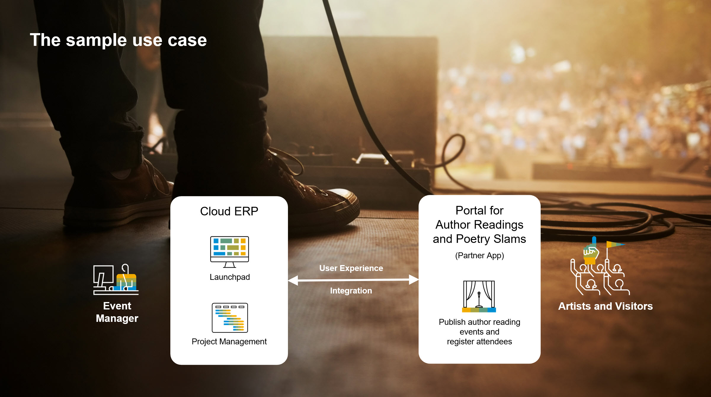

# Partner Reference Application

## Description

The *Partner Reference Application* provides a "golden path" to build, run and integrate full-stack cloud applications on the *SAP Business Technology Platform*.

With this repository we want to provide guidance for SAP partners to extend SAP ERP solutions by side-by-side cloud applications running on the *SAP Business Technology Platform* (BTP) in a scalable model. This guidance comprises
- an opinionated selection of BTP components with architecture guidance, 
- best practices ("golden paths") to build, deploy and provision full-stack BTP applications, and
- we pay special attention to the interoperability and integration with SAP cloud solutions such as *S/4HANA Cloud*, *Cloud for Projects* and *SAP Business ByDesign*.

The repository includes a sample application that is ready to deploy and run, and tutorials to re-build the sample application from scratch following an incremental development approach from one-off to multi-consumer solutions.

  

**About the sample application "Author Readings":**

Assume you are an event manager and your job is to organize and run author readings and poetry slams for reading clubs, book fairs and other occasions. 

Your company is running its business on an cloud ERP system provided by SAP and you mostly use the project management work center to plan and staff events, to collect costs and to purchase required equipment. 
Additionally an SAP partner provided a side-by-side application named "Author Reading Management" to publish author reading events and to register event participants and visitors. 

It was in particular important for you to separate the event publishing and participant registration from your ERP system for security and compliance reasons. Nevertheless, as a power user working in both systems you asked the partner to ensure a seamless user experience and navigation between the SAP system and the partner application.

Features of the author reading application:

1. Create and change author reading events; publish and block author readings
2. Add and remove participants; confirm and cancel participations
3. Calculate the number of free seats and block overbookings
4. One-click creation of projects for reading events and a preview of project information on the author reading UI (here, ERP authorizations must apply in the partner application as well!)
5. ERP users shall be able to launch the author reading app on their ERP launchpad, and it shall be possible to navigate from author readings to the associated project in the ERP system
6. Synchronize the status of the author reading event with the status of the associated project

Additionally, the sample showcases qualities relevant for enterprise-grade partner applications, supported by BTP services and programming models:

7. Standardized online development environment using the *Business Application Studio*
8. State-of-the-art web application architecture based on HTML5, NodeJS and HANA Cloud
9. Model-driven development based on the *SAP Cloud Application Programming Model* (CAP), *SAP Core Data Services* (CDS) and *Fiori Elements*
10. User experiences that fit to the SAP standard based on standard SAP floorplan patterns, and out-of-the-box theming and personalization
11. A draft concept to allow users to change data in multiple steps without publishing incomplete changes
12. Enterprise-grade security by authentication and role-based authorizations in line with SAP product standards and technology alignments
13. Enterprise-ready compliance by personal data management and audit log
14. Seamless and secure frontend and back-channel integration with SAP ERP solutions
15.	Delivering “open solutions” by integration-ready OData APIs and business events following SAP technology alignments
16. Deployment as one-off and multi-customer solution 

**Which BTP resources do we use for the partner reference application?**

The partner reference application is basically a NodeJS-application deployed on Cloud Foundry. 
We are using the *SAP Business Application Studio* as development environment and Github as code repository.
The *SAP Cloud Application Programming Model* (CAP) and *Fiori Elements* provide a model-driven development approach and empower us to focus on business objects, business logic and UI content. 
The use of BTP services save development- and application management effort and provide a trusted runtime in line with SAP standards.

**Join our community!**

Do you like to share your own ideas and best practices? Please feel welcome to a vivid conversation about the *Partner Reference Application* in our [SAP Community](https://blogs.sap.com/2022/06/03/build-and-run-cloud-applications-on-the-sap-btp/).

## Requirements

The application is based on the *SAP Business Technology Platform* (BTP) and integrated with SAP Cloud ERP Solutions. Therefore you need access to the following SAP solutions:
- *SAP Business Technology Platform* (BTP) account for test, demo and development (TDD account) or a BTP account for productive use,
- SAP Cloud ERP solution such as *SAP S/4HANA Cloud, public edition* or *SAP Business ByDesign* (you can focus on the integration with the ERP solution of your choice and skip the integration with other ERP solutions if not available),
- *SAP Identity Authentication Service* (IAS).

We are using the *Business Application Studio* as standardized development environment and *Github* as code repository.

## Download and Installation

You can start your journey following two paths:

1. Deploy and run the sample application as provided in this respository following the tutorials for deployment and provisioning of the one-off or multi-tenant version of the sample application.

2. Re-build the application from scratch following the guidelines step-by-step starting with tutorial "*Build a full-stack BTP Application with One-off Deployment in a Customer BTP Account*".

I would recommend to take the first approach and deploy the multi-tenant version of the sample application ([./Applications/author-readings-mt](./Applications/author-readings-mt)) as is, and then use the tutorials as retrospect to understand the steps taken to reach this state.

## Tutorials

Starting easy, we create, deploy and run a one-off (single-tenant) version of the application first:

1. Build a full-stack BTP Application with One-off Deployment in a Customer BTP Account
    1. [Prepare the BTP Account](Tutorials/01-Prepare-BTP-Account.md) 
    2. [Develop the Core of the BTP Application](Tutorials/02-Develop-Core-Application.md)
    3. [One-off Deployment](Tutorials/03-One-Off-Deployment.md)
    4. [Integration with SAP Business ByDesign](Tutorials/04-ByD-Integration.md)
    5. [Event-based Integration with SAP Business ByDesign](Tutorials/05-ByD-Event-Integration.md)
    6. [Manage Data Privacy](Tutorials/06-Manage-Data-Privacy.md)
    7. [Test, Trace and Debug](Tutorials/07-Test-Trace-Debug.md)

2. [Deploy the Sample Application to a BTP Account](Tutorials/20-Deploy-Sample-Application.md)

3. [A Guided Tour to explore the Capabilities of the Sample Application](Tutorials/30-Guided-Tour.md)

Enhance the application to support multiple customers using shared BTP resources:

4. [Enhance the BTP Application for Multi-Tenancy](Tutorials/40-Multi-Tenancy.md)

5. [Deploy the Multi-Tenant Application to a Provider Subaccount](Tutorials/44-Multi-Tenancy-Deployment.md)

6. [Provision Tenants of the Multi-Tenant Application to Customers](Tutorials/45-Multi-Tenancy-Provisioning.md)

7. [Connect a Tenant with *SAP Business ByDesign*](Tutorials/46-Multi-Tenancy-Provisioning-Connect-ByD.md)

Enhance your market reach and add *S/4HANA Cloud, public edition* as ERP-backend:

8. [Integrate the BTP Application with *S/4HANA Cloud, public edition*](Tutorials/51-S4HC-Integration.md)

9. [Connect a Tenant with *S/4HANA Cloud, public edition*](Tutorials/52-Multi-Tenancy-Provisioning-Connect-S4HC.md)

Enhance your market reach and add *S/4HANA Cloud for Projects, collaborative project management* as backend project management solution:

10. [Integrate the BTP Application with *S/4HANA Cloud for Projects, collaborative project management*](Tutorials/61-C4P-Integration.md)

11. [Connect a Tenant with *S/4HANA Cloud for Projects, collaborative project management*](Tutorials/62-Multi-Tenancy-Provisioning-Connect-C4P.md)

Open the APIs of the BTP application for 3rd-party integrations:

12. [Enhance the BTP Application by a Service Broker](Tutorials/71-Multi-Tenancy-Service-Broker.md)

13. [Configure and Consume the APIs of the BTP Application](Tutorials/72-Multi-Tenancy-Provisioning-Service-Broker.md)

After completing all steps you may have a scalable application with multiple customer subscriptions:

Related resources:
- [SAP Cloud Application Programming Model](https://cap.cloud.sap/docs/)
- [SAP Cloud SDK](https://sap.github.io/cloud-sdk/)
- [SAP Discovery Center](https://discovery-center.cloud.sap/missionssearch)
- [ByD API Overview](https://blogs.sap.com/2019/09/26/sap-business-bydesign-an-api-overview/)
- [ByD OData API Usage Samples](https://blogs.sap.com/2019/02/27/sap-business-bydesign-api-usage-samples/)

## Known Issues

No known issues.

## How to obtain support

This repository is provided "as-is"; no support is available. For questions and comments, [join the SAP Community](https://answers.sap.com/questions/ask.html).

## License

Copyright (c) 2022 SAP SE or an SAP affiliate company. All rights reserved. This project is licensed under the Apache Software License, version 2.0 except as noted otherwise in the [LICENSE](LICENSE) file.
