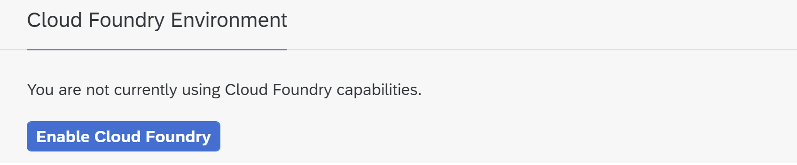
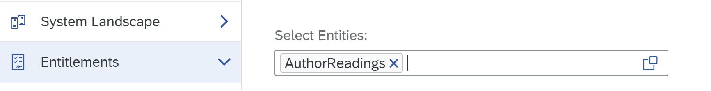
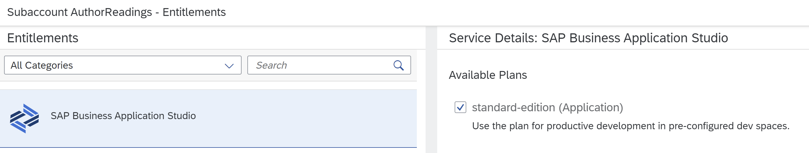
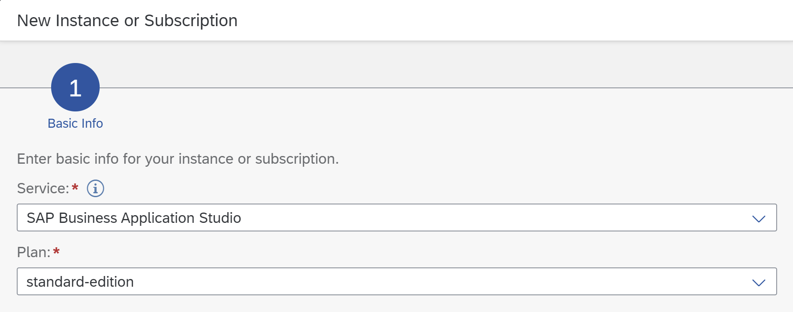
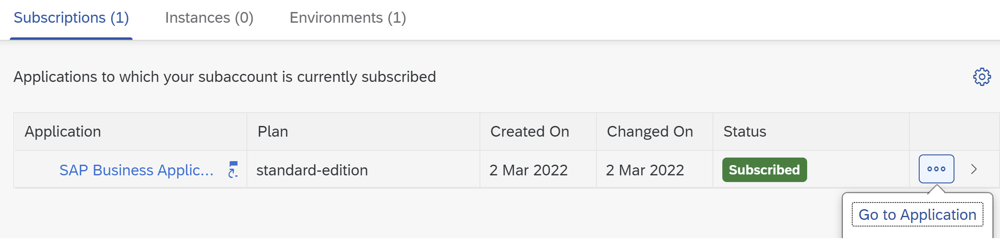
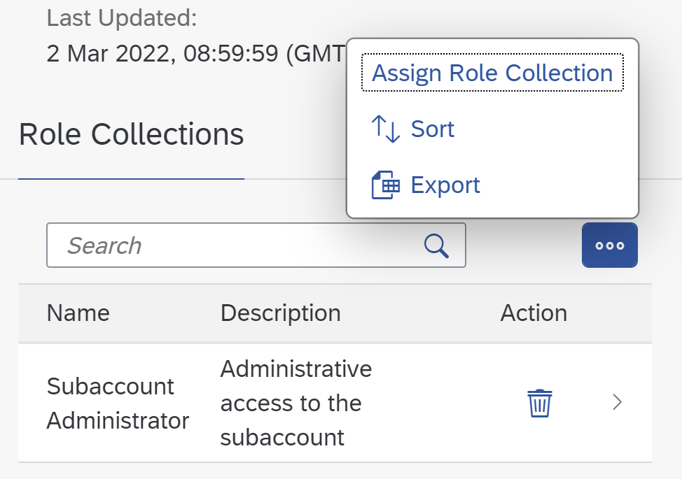
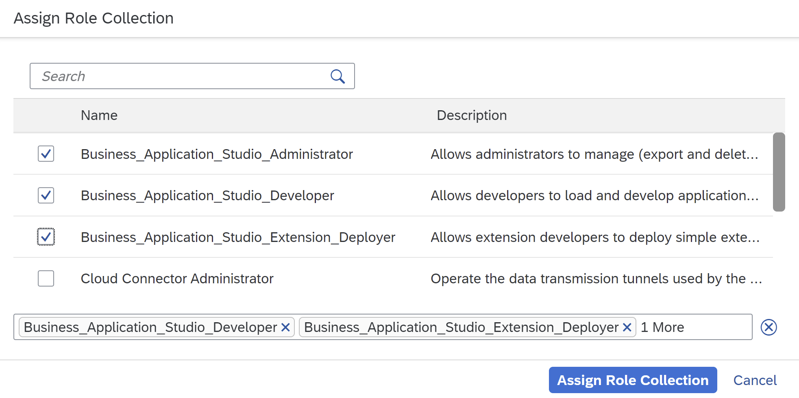
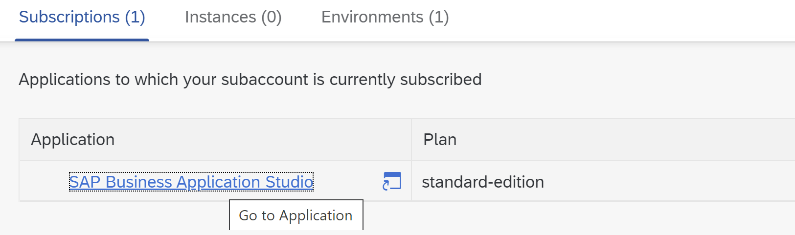
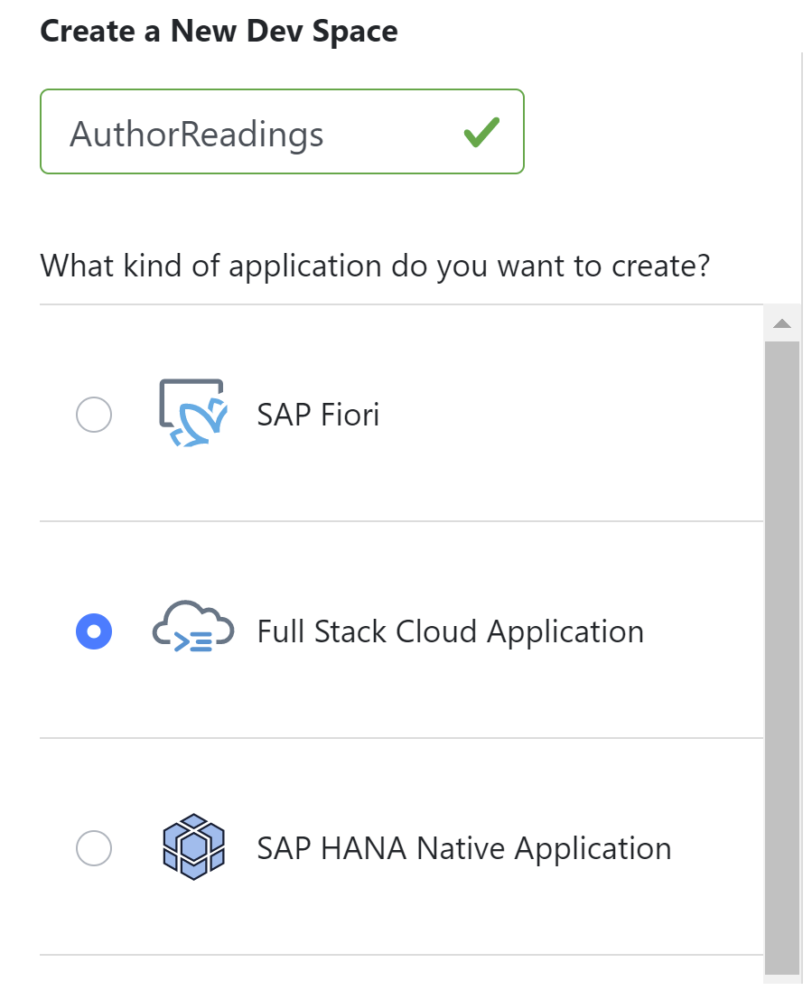

# Prepare the BTP Account

## Assumptions / Preconditions

Before you can start with the tutorial you need to have an own SAP BTP Global Account with an unused quota for *Cloud Foundry Runtime* and the *SAP Business Application Studio*.

Furthermore you should have access to a github organization to create a new github repository for the tutorial application.

## Setup BTP Subaccount

### Create Subaccount

At first navigate to your *BTP Global Account* and create a new *Multi-Environment*-Subaccount with name `AuthorReadings` and provider *Amazon Web Services (AWS)*.

### Enable Cloud Foundry Runtime
By default Cloud Foundry is disabled for new BTP Subaccounts. That is because not every BTP Subaccount is meant for application development.

Enable Cloud Foundry using the proposed standard settings:

| Property       | Value                              |
| :------------- | :--------------------------------- |
| Environment:   | Cloud Foundry Runtime              |
| Plan:          | *standard*                         |
| Landscape:     | choose an appropiate AWS landscape |
| Instance Name: | *authorreadings*                   |
| Org Name:      | *authorreadings*                   |

### Enable SAP Business Application Studio

After creating a new BTP Subaccount, only the standard services appear in the entitlements list. To enable *SAP Business Application Studio*, assign an according entitlement to the newly created BTP Subaccount.

For this navigate to the BTP Global Account and go to *Entitlements* and *Entity Assignments*. Open the value help on the *Select Entities* field and mark the corresponding BTP Subaccount.

Press on *Configure Entitlements* and then *Add Service Plans*. Select the *SAP Business Application Studio* entitlement and decide for an available plan.

Press on *Add 1 Service Plan* and *Save*.

Navigate back to your BTP Subaccount. The *SAP Business Application Studio* is now available in the list of Entitlements. Create an instance of this service within the BTP Subaccount by going to the *Service Marketplace* and look for *SAP Business Application Studio* and press *Create*.

The instance appears in the list of subscriptions.

Just starting it will result in an *Access Denied* because the user roles are not yet assigned for this service instance. To do so, go to *Security* and *Users*. Select your user and and go to the assigned *Role Collections*. Select all 3 roles of *SAP Business Application Studio* and confirm the assignment.

Three role collections have been added by *SAP Business Application Studio* already.

Now you can start the *SAP Business Application Studio*. If the access is denied wait some seconds and try again. You may need to clear your browser cache.

After starting the development environment, create a new *Dev Space* for the development of this tutorial. Name it `AuthorReadings` and choose to create a *Full Stack Cloud Application*.

## Setup GIT repository

Create a new github repository in a github organization of your choice as code repository of your own project and link it with your *Dev Space*.

Alternatively you can clone this repository into your *Dev Space* to deploy and run the sample application as provided in this repository.
