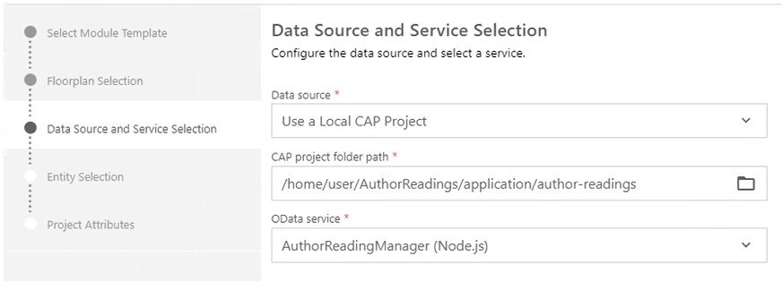
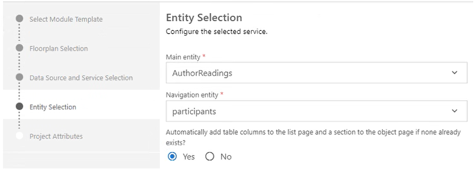
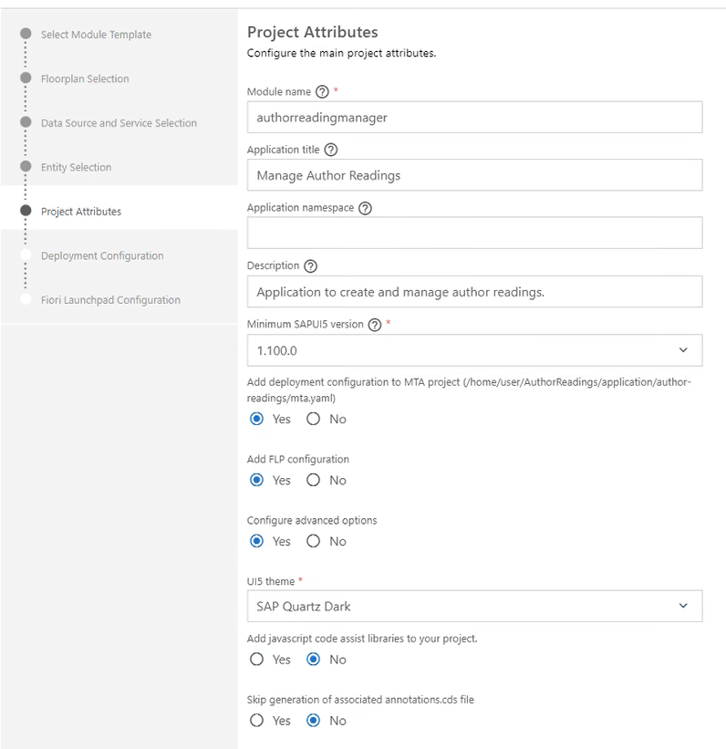
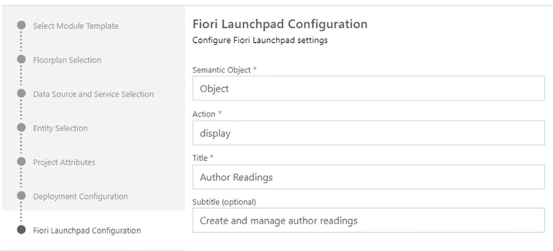
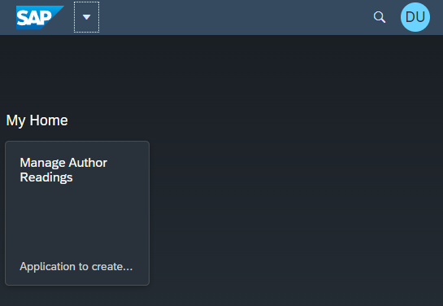

# Develop the Core of the BTP Application

## Initialize New CAP-based Project
To start a new development project initialize it with the *Core Data Services (CDS)* by opening the command line and type `cds init author-readings`. This creates a folder with name `author-readings` and a set of files to start a CAP project. Navigate into the new folder by typing `cd author-readings`.

Next add support for *Multi Target Applications (MTA)* and *HANA* to the project by typing `cds add mta` and `cds add hana`. At last perform an `npm install` to add dependend node modules.

Have a look at the [CAP Command Line Interface Documentation](https://cap.cloud.sap/docs/tools/#command-line-interface-cli).

## Define Entity Models

The entity model represents actually the relational database model of the application. All entities (tables), their relations (associations) and additional meta data (annotations) are maintained in the entitiy models. See also [CAP Documentation of Entity Models](https://cap.cloud.sap/docs/guides/domain-models).

The CAP Programming Model defines that all Entity Models (Domain Models) must be stored in the `/db` folder of the project. Therefore let's create a new file `/db/entity-models.cds` and add our appliation entities.

Within a `.cds` file you can specify a namespace, which is used to structure the entities and avoid too long names when using them. Reuse components can be included adding a `using` statement. You can define as many entities as required by using the `entity` keyword.

Additional metadata can be added to entities by annotating them using the `annotate` keyword. That is usefull to separate the entity definition and additional metadata into different files to increase readability of the code. More details of adding annotations can be found [here](https://cap.cloud.sap/docs/advanced/odata#annotations).

> Copy the [Tutorial Entity Definitions](../Applications/author-readings/db/entity-models.cds) into your project.

## Create Initial Data

To get started easily let's create some [initial data](https://cap.cloud.sap/docs/guides/databases#providing-initial-data), which should be available directly after starting the application. This data can be specified in CAP by created a set of csv-files in the `/db/data` folder of the project.

The corresponding entity is encoded in the filename by concatenating the namespace and the entity name together (e.g. `sap.samples.authorreadings-Participants.csv`).

> Copy the [Initial Data](../Applications/author-readings/db/data/) into your project.

## Define Services

After you have defined the entity model a set of [CAP Services](https://cap.cloud.sap/docs/guides/providing-services) must be defined to add business logic and external APIs of the application. All service definitions must be located in the `/srv` folder. Therefore create a new file `/srv/service-models.cds`.

> Copy the [Service Definition](../Applications/author-readings/srv/service-models.cds) into your project. You may need to commend out service model parts that refer to the API-led integration with the ERP solution; compare [Service Definition w/o remote services](../Applications/author-readings/srv/service-models_without_ERP-integration.backup).

## Add Localization Content

Language specific content such as labels and texts is stored in properties-files in i18n-folders.

Our app is based on the CAP default settings:
- All labels used in the entity model, service model and the web application are stored in `i18n.properties` files in folder `./db/i18n`
- All system message texts are stored in `messages.properties` files in folder `./srv/i18n`

For non-default languages just append the ISO-code of the language to the file name, for example `i18n_de.properties` and `messages_de.properties`.

> Copy the [db-i18n files](../Applications/author-readings/db/i18n) and [messages files](../Applications/author-readings/srv/i18n) into your project.

## Create Business Logic

To also add some behavior to the data models you can implement a set of exits in form of event handlers. Create a file `/srv/service-implementation.js` as referenced from the `service-models.cds` definition. In there all required event handlers can be implemented. Every entity defined in the service definition comes with some generic event handlers for the CRUD (create, read, update, delete) operations. Additionally one event handler can be registered per action (e.g. *block* or *publish*).

Note that some reuse functions have been defined in a separate file. These are contants for code list values, reuse functions to verify email and phone numbers as well as a function to emit events as they are used several times from the service-implementation.

> Copy the [Service Implementation](../Applications/author-readings/srv/service-implementation.js) and the [reuse functions](../Applications/author-readings/srv/reuse.js) into your project.

## Add Web Application with Fiori Elements
Next we will add an *SAP Fiori Element* based user interface.

### Fiori Element Application Wizard
Start the wizard by searching for *Create MTA Module from Template*.


Select the Module Template: *SAP Fiori Application Template*
Select *List Report Object Page*

Select a Data Source and Service as shown below.



Select the entity, which should be shown in the main list of the List Report. In our example this is the *AuthorReadings*.



And add further project attributes



Select *Cloud Foundry* as Target of the Deployment Configuration. For now the destination name is set to *none*, because we will configure it in a later step of this tutorial.

Last configure the *Fiori Launchpad Configuration*



and press *finish*.

The wizard will create a couple of files in the `/app` folder, which is containing all user interface related files.

Now the application can already being started for local testing in SAP Business Application Studio. 
1. Open a terminal and start the app with the sandbox profile using the run command `cds watch --profile sandbox`. 
2. Use the test users as listed in file `.cdsrc.json`. 
3. The Launchpad sandbox including the generated tile appears; click on the tile "Manage Author Readings" to launch the web app.

    

### Fine Tune User Interface
The generated user interface can be adapted to specific needs by changing the generated files. Most important are:

- [`app/authorreadingmanager/annotations.cds`](../Applications/author-readings/app/authorreadingmanager/annotations.cds)
- [`app/authorreadingmanager/webapp/manifest.json`](../Applications/author-readings/app/authorreadingmanager/webapp/manifest.json)

#### Autoload Data
By default lists are not filled automatically when the List Report is displayed. You can change this by enabling the autoload feature. For this go to the `/app/authorreadingmanager/webapp/manifest.json` and add the following parameter:

```json
{
    "sap.ui5": {
        "routing": {
            "targets": {
                "AuthorReadingsList": {
                    "options": {
                        "settings": {
                            "initialLoad": true
                        }
                    }
                }
            }
        }
    }
}
```

#### Color Coding
A color coding for certain columns in the user interface can be achieved by adding a hidden column *statusCriticality*, which contains the color information. This column is not part of the database model, but only added in the service definition and filled danymically at READ of the entity.

- Field definition in [service-models.cds](../Applications/author-readings/srv/service-models.cds)
- Logic to fill it in [service-implementation.js](../Applications/author-readings/srv/service-implementation.js)
    ```javascript
    if(authorReading.statusCode) {
        switch (authorReading.statusCode.code) {
            case reuse.authorReadingStatusCode.inPreparation:
                authorReading.statusCriticality = reuse.color.yellow; // New author readings are yellow
                break;
            case reuse.authorReadingStatusCode.published:
                authorReading.statusCriticality = reuse.color.green; // Published author readings are Green
                break;
            case reuse.authorReadingStatusCode.booked:
                authorReading.statusCriticality = reuse.color.yellow; // Booked author readings are yellow
                break;
            case reuse.authorReadingStatusCode.blocked:
                authorReading.statusCriticality = reuse.color.red; // Blocked author readings are red
                break;
            default:
        }
    }
    ```
- A couple of entries in the i18n files to get column headers right
- An entry in the [annotations.cds](../Applications/author-readings/app/authorreadingmanager/annotations.cds) to get the column displayed

The color values as defined in the reuse constants are fixed values interpreted by the user interface automatically.

### Draft Concept
The CAP / Fiori Elements stack supports a *Draft Concept* out of the box. This enables users to store inconsistent data without publishing them to others users already. Details can be found [here](https://cap.cloud.sap/docs/advanced/fiori#draft-support).

## Add Authentication and role-based authorization
To protect the application for unauthorized access, we add a user based authentication and authorization to the application. Roughly speaking the application defines `Roles` and assigns these statically to service operations like reading or writing a certain entity. The customer creates `Role Templates`, which group a set of `Roles` and is assigned to named users of the customer. You can find further details in the [CAP Authorization Guide](https://cap.cloud.sap/docs/guides/authorization).

First of all the `Roles` should be defined as part of the application definition concept. For the author Reading application we defined two roles: *AdminRole*, *AuthorReadingManager*.

The authorization is always defined on service level, in our application on the level of the `/srv/service-models.cds`. For better readeability we seprate the authorization definitions from the service definitions by creating a new file `/srv/service-auth.cds` to contain all authorization relevant model parts.

Next a `xs-security.json` is generated by executing `cds compile srv/ --to xsuaa > xs-security.json`, which contains all runtime relevant security settings of our application. Open the generated file and add 2 `Role Collection` definitions into the top object.

```json
"role-collections": [
    {
        "name": "AuthorReadingManagerRoleCollection",
        "description": "Author Reading Manager",
        "role-template-references": [
            "$XSAPPNAME.AuthorReadingManagerRole"
        ]
    },
    {
        "name": "AuthorReadingAdminRoleCollection",
        "description": "Author Readings Administrator",
        "role-template-references": [
            "$XSAPPNAME.AuthorReadingAdminRole"
        ]
    }
]
```
		
> Note: Uniqueness of role collections becomes an issue in case of multiple deployments (role collections must be unique within a subaccount). This can be achieved by prefixing namespace.

Furthermore make sure the `package.json` contains this part to tell the CDS-framework that we use the XSUAA-Service of the *SAP Business Technology Platform*.

package.json:
```json
"cds": {
    "requires": {
        "db": {
            "kind": "sql"
        },
        "uaa": {
            "kind": "xsuaa"
        }
    },
    "hana": {
        "deploy-format": "hdbtable"
    }
}
```

Next the `mta.yml` needs to be extended with a new Cloud Foundry service instance definitions and according usages of it in our application. The `mta.yml` had been generated when creating a new CAP project and is containing all deployment relevant information.

Below a snippet from the `mta.yml` focusing on the authorization relevant additions.
```yml
...
modules:
- name: author-readings-srv
  requires:
  - name: author-readings-db
  - name: author-readings-uaa
...
- name: author-readings-db-deployer
  requires:
  - name: author-readings-db
  - name: author-readings-uaa
...
resources:
- name: author-readings-uaa
  type: org.cloudfoundry.managed-service
  parameters:
    path: ./xs-security.json
    service: xsuaa
    service-name: author-readings-uaa
    service-plan: application 
    config:
      xsappname: author-readings-${space} # app name + CF space dependency
      tenant-mode: dedicated
...
```

Next step is to add the node module `passport` to our application project. This can be done by executing `npm add passport`. This statement will download the module and add an according dependency to the applications' `package.json`.

Last we need to define some users and their roles for local testing. This is done in the `.cdsrc.json` file as follows. Here 3 users with name, password and assigned roles are defined.

```json
{
    "auth": {
        "passport": {
            "strategy": "mock",
            "users": {
                "Kate Jacob": {
                    "password": "welcome",
                    "ID": "kjacob",
                    "roles": [
                        "AuthorReadingManagerRole",
                        "authenticated-user"
                    ]
                },
                "Peter Sellers": {
                    "password": "welcome",
                    "ID": "pseller",
                    "roles": [
                        "AuthorReadingAdminRole",
                        "authenticated-user"
                    ]
                },
                "Julia Brunner": {
                    "password": "welcome",
                    "ID": "jbrunner",
                    "roles": [
                        "authenticated-user"
                    ]
                },
                "*": true
            }
        }
    }
}
```

## Testing

Now the web application can be started and locally tested in the SAP Business Application Studio:
1. Open a terminal in the SAP Business Application Studio 
2. Run command `npm install` to ensure all modules are loaded and installed.
3. Start the app with the sandbox profile using the run command `cds watch --profile sandbox`; the popup "A service is listening to port 4004" indicates that the sandbox runtime has been started successfully.
4. Open the test environment by clicking on button "Open in a New Tab" on the popup or by clicking on the link "http://localhost:4004" in the terminal. In result a browser tab opens with the all web applications and OData service endpoints. 
5. Testing the web app: 
    1. Click on the *Web Application* */authorreadingmanager/webapp/index.html*
    2. A logon popup appears; use the test users as listed in file `.cdsrc.json`.
    3. The Launchpad sandbox including the generated tile appears; click on the tile "Manage Author Readings" to launch the web app.

> Note: If you would like to switch users, the browser cache needs to be cleared before. This can be for example done in Chrome by pressing `CTRL+SHIFT+DEL` (or in German: `STRG+SHIFT+ENTF`), go to *Advanced* and choose a time range and *Passwords and other sign-in data*.

## Test Automation

It is always a good idea to add automatic tests to the application. This can be done by using standard javascript libraries like chai and mocha.
