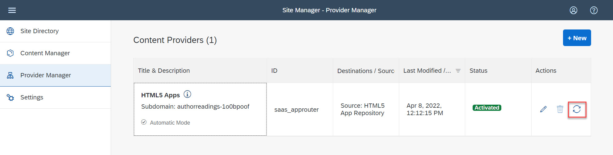
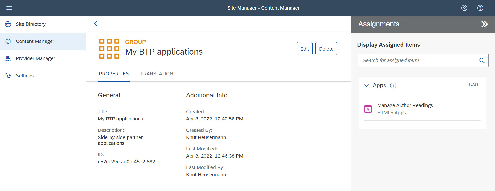

# One-off Deployment

Deploy the application into a subaccount of the customer BTP global account and integrate the subaccount with the customer identity provider (IDP) for authentication.

## Setup the BTP Subaccount

BTP Cockpit (Global account):

Create a subaccount to host the application runtime (in our example we used the data center of *Amazon Web Services (AWS)* and the region *Europe (Frankfurt)*). You can reuse the subaccount used for development for convience.

Optional: Assign subaccount to a Directory as parent.

Check if sufficient service assignments are available in your global account:
- Cloud Foundry Runtime (3 units of Application runtime)
- SAP HANA Cloud (1 unit)
- SAP HANA Schemas & HDI Containers
- Launchpad Service 

Open *Entity Assignments* and assign quotas for the following entities to your subaccount in which you want to deploy the application: 
- *Cloud Foundry Runtime* (3 units of Application runtime)
- *SAP HANA Cloud* (1 unit)
- *SAP HANA Schemas & HDI Containers*
- *Launchpad Service* (plan: *standard (Application)*)

> Note: The value help may not offer an item referring to "Cloud Foundry". In this case select "Application runtime" and save the change, the name of item in the list of entity assignment is changed to "Cloud Foundry Runtime". 

## Enable Cloud Foundry

BTP Cockpit (subaccount):

Open the subaccount *Overview* and enable Cloud Foundry:
    - Plan: standard
    - Landscape: cf-eu10
    - Instance Name: authorreadings
    - Org Name: auhtorreadings

Create Space - authorreadings-runtime
    - keep standard roles
    - Add CF Org members
	- Add CF space members

## Create a HANA database

BTP Cockpit (subaccount):

Open the Cloud Foundry space, navigate to SAP HANA Cloud and create a HANA database: 
   - Choose CF Organization + Space
   - Instance Name: authorreadings-db
   - Enter a password
   - Save

## Subscribe Lauchpad application

BTP Cockpit (subaccount):

Open the *Service Marketplace* and select the *Launchpad Service*.
Create a subscription of the *Launchpad Service* with
    - Service: *Launchpad*
    - Plan: *standard - Subscription*

Open *Users* and add the role collection *Launchpad_Admin* to your user.

> Note: The SAP Launchpad provides the managed application router, which we are using to manage application authentication and tokens. You need to subscribe the Launchpad service before deploying your application to ensure that the Web app can be published as "HTML5 Application".


***Prepare project configuration (make adjustments) for Cloud Foundry deployments***

Next, let’s make some adjustments so that the app can be deployed to Cloud Foundry as a central Launchpad content.

Configure web app to connect to the app services. Define a route in the web app: Open file `./app/authorreadingmanager/xs-app.json` and add the following route at position 1 (the order matters! The most specific one should be in the beginning)
> Note: We will define the destination “cap-launchpad” later as part of project configuration mta.yml file 

```json
"routes": [
  {
    "authenticationType": "none",
    "csrfProtection": false,
    "source": "^/authorreadingmanager/",
    "destination": "launchpad"
  },
  ...
]
```
		
Check and adjust/add the service name in webapp configuration file at the end: Open file `./app/authorreadingmanager/webapp/manifest.json`.
> Note: This service name needs to be unique within your account and will appear in the runtime URL of the application.

```json
"sap.cloud": {
   "public": true,
   "service": "authorreadingmanager"
}
```

Add to `package.json`
```json
"engines": {
   "node": "^14"
}
```

## Configure project deployment config files:

Adjust and configure the destination-content module in file `./mta.yaml`. Here you define destinations and service keys for the destinations. After the MTA app has been deployed, you will see two destinations `html_repo_host` and `…_uaa_fiori` in your subaccount.
> Note: that the service name `authorreadingmanager` which we defined in manifest.json file


TODO: copy from current file
```yml
modules:
- name: author-readings-destination-content
   type: com.sap.application.content
   requires:
   - name: author-readings-destination-service
      parameters:
      content-target: true
   - name: author-readings-repo-host
      parameters:
      service-key:
         name: author-readings-repo-host-key
   - name: author-readings-uaa
      parameters:
      service-key:
         name: author-readings-uaa-key
   parameters:
      content:
         instance:
            destinations:
            - Name: readingeventmanager_CAE_PoC_GP_repo_host
               ServiceInstanceName: CAE-PoC-GP-html5-srv
               ServiceKeyName: CAE-PoC-GP-repo-host-key
               sap.cloud.service: readingeventmanager
            - Name: readingeventmanager_uaa_fiori
               Authentication: OAuth2UserTokenExchange
               ServiceInstanceName: CAE-PoC-GP-uaa-srv
               ServiceKeyName: CAE-PoC-GP-uaa-key
               sap.cloud.service: readingeventmanager
            existing_destinations_policy: ignore
   build-parameters:
      no-source: true
```

Add the destination service resource in file ./mta.yaml ,Here you define destination resource to the route defined in web application configuration file `./app/authorreadingmanager/xs-app.json`.
> Note: that the name `launchpad` of the route in `xs-app.json` should match with the destination service resource name in `mta.yaml` file

```yml
- Authentication: NoAuthentication
  Name: launchpad
  ProxyType: Internet
  Type: HTTP
  URL: ~{srv-api/srv-url}
  HTML5.DynamicDestination: true
  HTML5.ForwardAuthToken: true
```

Add the destination service resource in file `./mta.yaml` ,Here you define destination resource to the route defined in web application configuration file./app/readingeventmanager/xs-app.json
  
Add service api as a required dependency of the destination in file `./mta.yaml`:

```yml
requires:
  - name: srv-api
```

> Note: after the above changes the destination resource in mta.yml file will look like below : 
	
```yml
resources:
- name: CAE-PoC-GP-dest-srv
   type: org.cloudfoundry.managed-service
   parameters:
      config:
      HTML5Runtime_enabled: true
      init_data:
         instance:
            destinations:
            - Authentication: NoAuthentication
               Name: ui5
               ProxyType: Internet
               Type: HTTP
               URL: https://ui5.sap.com
            - Authentication: NoAuthentication
               Name: cap-launchpad
               ProxyType: Internet
               Type: HTTP
               URL: ~{srv-api/srv-url}
               HTML5.DynamicDestination: true
               HTML5.ForwardAuthToken: true
               existing_destinations_policy: update
      version: 1.0.0
      service: destination
      service-name: CAE-PoC-GP-dest-srv
      service-plan: lite
   requires:
   - name: srv-api
```

> Note: after all the above project configuration changes to the project configuration file `mta.yml`, the file would look like below:

TODO --> link to complete file!!!

## Enable additional request origins (CORS)

In this step we enable citizen users to build AppGyver applications that connect to the OData services of our BTP application as backend.
In general Appgyver expects the server to handle Cross Origin Request Sharing (CORS). However, by default CAP services do not allow cross origin requests.

Therefore we enhance the default bootstrapping by some custom logic to allow AppGyver applications to access the OData services (compare https://cap.cloud.sap/docs/node.js/cds-serve).

Create a file *server.js* in the the root folder of the application to define allowed request origins for CORS checks. In our example we allow all origins for simplicity; for productive use specific origins shall be listed and allowed only.

```javascript
// Define allowed access origins for CORS checks.
// In our example we allow all origins; for productive use specific origins shall be allowed only.
const cds = require('@sap/cds')
cds.on('bootstrap', (app) => {
    const cors = require('cors')
	app.use(cors())
	app.use((req, res, next) => {
		res.setHeader('Access-Control-Allow-Origin', '*');
		next();
	});
})
cds.on('listening', () => {
	// add more middleware ...
})
module.exports = cds.server // delegate to default server.js
```

Enhance the file *package.json* by the dependency:

```json
    "dependencies": {
	"cors": "^2.8.5"
    },
```

## Deploy to Cloud Foundry

https://cap.cloud.sap/docs/guides/deployment/to-cf

go to application folder

login to console
CF API https://api.cf.eu10.hana.ondemand.com
CF Login
- select org and space

select build MTA_Project from context menu on mta.yaml file.

Result:
Services
HTML5 Application


## Configure the Launchpad

Once you have deployed your application successfully, the included Web application is available as HTML5 Application and ready to be added to a Launchpad site.

1. Open the *Launchpad Site Manager* by launching the application *Launchpad Service* from your section *Instance and Subscriptions* in your BTP subaccount.

**Fetch the latest version of your Web application:**

2. Open the *Provider Manager*. The *HTML5 Apps* content provider is created automatically and all Web applications that you deployed to the BTP subaccount are automatically added as content to this content provider.

3. Select the content provider *HTML5 Apps* and fetch any updates of your Web application by clicking the fetch updated content icon. The HTML5 Apps content provider should now expose the latest version of the Web application. 



> Note: You need to update the content provider whenever you changed the Web application.

**Add the web application to your content:**

4. Open the *Content Manager* and navigate to the *Content Explorer* sheet, select the content provider *HTML5 Apps* and add your Web application to your content by clicking on *Add to my Content*. 

**Create a group and add you app to the group:**

5. Open the *Content Manager* and navigate to sheet *My Content*.

6. Create a new group (button *+ New* >> *Group*) and enter a title and desciption.

7. On the *Assignments*-panel, click into the search box to get the list of available apps. Click on "+"-symbol behind your app to assign your app to the group.

8. Save the group.



**Assign the Web application to the default role:**

In this step, you’ll assign your app to the "Everyone" role. This is a default role - content assigned to this role is visible to all users.

9. Open the *Content Manager* and navigate to sheet *My Content*.

10. Click the role *Everyone* to open the role editor.

11. Edit the role: On the *Assignments*-panel, click into the search box to get the list of available apps. Click on "+"-symbol behind your app to assign your app to the role.

12. Save the role.

**Create/update a site:**

In this step we create and review a launchpad site. If you already have a site, then just add your Web application.

13. Open the *Site Directory*. Create a site and enter a site name.

14. Launch the site with button *Go to site* and test your Web application. 

> Note: Take note of the launchpad site URL as **BTP Application Launchpad URL**. On the launchpad, open the context menu of the tile "Author Readings" and take note of the URL as **BTP Application URL**. We will use these URLs for later testing and to embedd the BTP application in the launchpads of ByD and S4HANA Cloud.

> Note: The URL of the web application as provided in the BTP provider subaccount under *HTML5 Applications* does not route requests via the managed application router of the SAP Launchpad service and hence user attributes are not propagated to the application. You may encounter this by observing a login user "Default User".


## Configure Authentication and Authorization 

We use the *SAP Identity and Authentication Service* (IAS) as corporate identity provider (IDP) and establish a trust relationship between the service provider (our BTP subaccount to which we deployed our application) and the IAS tenant. In result the BTP subaccount and our application delegates user authentications to the IAS tenant incl. single sign-on. Furthermore we use the IAS tenant to assign authorization roles to users via user groups.

Precondition: You have admin access to an *SAP Identity and Authentication Service* tenant. 

### Configure Single Sign-on using the *SAP Identity and Authentication Service*

As preferred approach we configure the trust between the BTP subaccount and the IAS using Open ID Connect (OIDC). As fallback I described a SAML 2.0 trust configuration as well.

#### Open ID Connect Configuration

Setup the trust relationship between the BTP subaccount to IAS using Open ID Connect (OIDC).

> Note: As precondition of this setup the BTP subaccount and the IAS tenant need to be assigned to the same customer ID.

BTP sub-account:

1. Open menu item *Security* >> *Trust Configuration* and click on "Establish Trust" and select the IAS tenant to setup the OIDC trust configuration.

IAS Admin UI:

2. Login to the IAS admin UI (URL: <IAS>/admin/) 

3. Open menu item *Applications* and search the application that refers to your BTP subaccount (the name typically follows the pattern: XSUAA_<subaccount-name>).

4. Edit the application and change the following fields:
    - The display name appears on user login screen and the login applies to all applications liked to the IAS tenant (following the SSO principle). Change the "Display Name" to something meaningful from an end-user point of view representing the scope of the IAS, for example "Almika Inc. - User login" or something more general if you have multiple apps running in your subaccount.
    - Enter the "Home URL", e.g. using the link to the Launchpad site or the application.

#### SAML 2.0 Configuration (fallback)

Setup the trust relationship between the BTP subaccount to IAS using SAML 2.0. This approach is the fallback trust configuration if the OIDC configuration is not possible. 
	
> Note: This fallback applies if the BTP subscriber subaccount and the IAS tenant are not assigned to the same customer ID. This setup comes with limitations regarding  remote access to the OData services of the BTP app with principal propagation.

BTP subaccount:

1. Download the **Service provider SAML metadata file**: Open menu item *Security* >> *Trust Configuration* and click on *Download SAML Metadata*.

IAS Admin UI:
	
2. Open menu item *Applications* and create a new application of type *Bundled application*.
	- Enter the required information like application display name, application URL, … The display name appears on user login screen and the login applies to all applications liked to the IAS tenant (following the SSO principle). Choose something meaningful from an end-user point of view representing the scope of the IAS, for example "Almika Inc. - User login" or something more general if you have multiple apps running in your subaccount.
	- Open section *SAML 2.0 Configuration" and upload the **Service provider SAML metadata file** from the BTP subaccount.
	- Open section *Subject Name identifier* and select "E-Mail" as basic attribute.
	- Open section *Default Name ID Format* and select "E-Mail".

3. Download the **IDP SAML metadata file**: Open menu item *Tenant Settings* >> *SAML 2.0 Configuration* and click on *Download Metadata File* (the button in the lower left corner).

BTP subaccount:

4. Open menu item *Security* >> *Trust Configuration* and click on *New Trust Configuration*. Upload the **IDP SAML metadata file** and enter a meaningful name and description for the IDP (for example "Corporate IDP" or "Custom IAS (SAML2.0)").
	
### Setup Users and User Groups

In our example we are using IAS user groups to assign authorizaton roles to users. The user groups will be passed as "assertion attribute" to the BTP subaccount and will be mapped to respective role collections in the BTP subaccount. 

IAS Admin UI:

1. Open menu item *User Management* and add the users who shall have access to the BTP application. Enter user details like name and e-mail and take into account that the e-mail is used as identifying attribute and hence I would recommend to use the e-mail address as used in the ERP system that we will integrate later.
	
2. Open menu item *User Groups* and add user groups that represent typical user roles and enter a unique (technical) *Name* and a meaningful "Display Name*, for example:

 | Name:                      | Display name:              |
 | :------------------------- | :------------------------- |
 | admin                      | Administrator              |
 | author_reading_manager     | Author Reading Manager     |
 | author_reading_participant | Author Reading Participant |

3. Open menu item *Applications*, open the application referring to the BTP subaccount with your application, and navigate to *Assertion Attributes*. 
Check if the *User Attribute* "Groups" is already mapped to the *Assertion Attribute* "groups". If not, then add the attribute mapping.

BTP subaccount:
	
4. Open menu item *Role Collections* and add the user groups (using the unique technical name of the user group) to the role collections that shall be assigned to the respective users with the use group, for example: add user group "author_reading_manager" to role collection "AuthorReadingManagerRoleCollection"; add the user group "admin" to the role collections "AuthorReadingAdminRoleCollection", "Launchpad_Admin" and "Subaccount Administrator".

### Login to the BTP Application and test Single Sign-on

Launch your BTP application and select the IAS tenant as IDP. 

> Note: The first attempt to open the app may fail with an authorization error message if the user has not yet been replicated from the IAS tenant to the BTP subaccount (latest at this point this replication is triggered and executed atomatically). The second login attempt to open the app should be successful always.

You may deactivate the "Default Identity Provider" (which refers to the SAP ID Service) in the trust center of your BTP subaccount.


