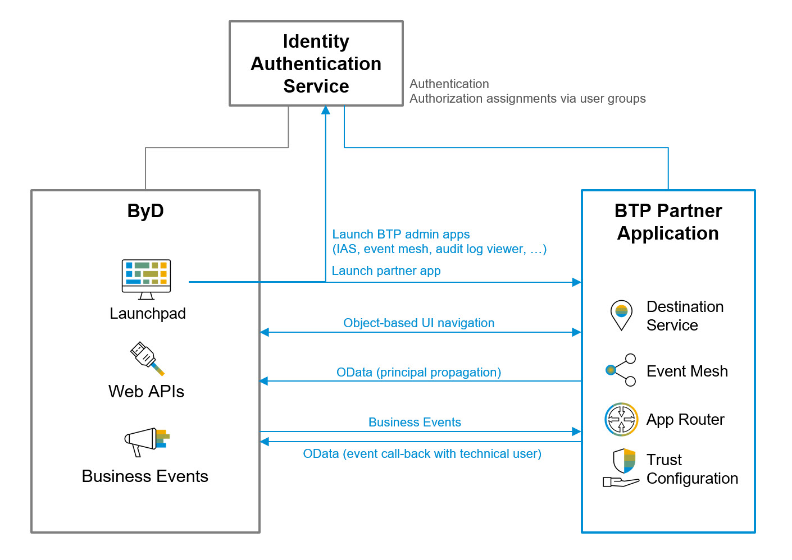
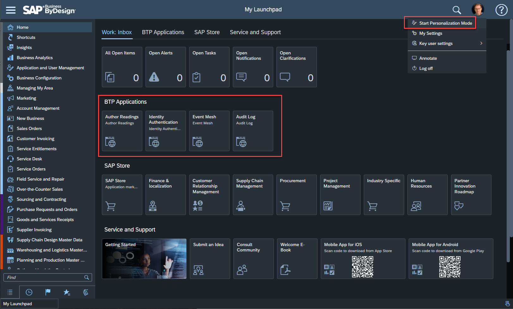

# Integration with SAP Business ByDesign

In this chapter we integrate the BTP application with SAP Business ByDesign (ByD).

Frontend integration:
1. Launch the BTP app from the ByD launchpad,
2. Launch BTP administration applications such as the IAS admin app from the ByD launchpad,
3. Navigate from the BTP app to related ByD projects (ByD Project Management),
4. Single sign-on for ByD, the BTP app and all BTP admin apps using the same IAS tenant as IDP.

Back-channel integration:

3. Create ByD projects from the BTP app using OData APIs with principal propagation,
4. The BTP subscribes to ByD events notifications to set the status of author readings according the status of related projects in ByD.



## Configure Single Sign-on for ByD

We use the *SAP Identity and Authentication Service* (IAS) as corporate identity provider (IDP) and establish a trust relationship between the service provider (our ByD tenant) and the IAS tenant. In result ByD delegates user authentications to the IAS tenant incl. single sign-on. 

We setup the trust relationship between ByD and IAS using SAML 2.0 and we use e-mail to identify the user.
Therefore, make sure the same e-mail addresses are entered for users in ByD as well as in the IAS tenant.

IAS Admin UI:

1. Download the **IDP SAML metadata file**: Open menu item *Tenant Settings* >> *SAML 2.0 Configuration* and click on *Download Metadata File* (the button in the lower left corner).

ByD:

2. Open work center *Application and User Management* and navigate to *Common Tasks* >> *Configure Single Sign-on*.
3. Go to the *Identity Provider* sheet, and in the list *Trusted Identity Provider*, click on the button *New Identity Provider*. 
4. Upload the **IDP SAML metadata file** which you downloaded from IAS tenant. 
5. Enter a suitable name for the IDP as *Alias*. The alias is displayed in the selection screen to choose an IDP in case you configure multiple identity provider in ByD.   
6. In the list under *Supported Name ID Formats*, add "E-Mail Address" as additional *Name Id Format* and use the *Actions* button group to set the e-mail address default name ID format. 
7. Click on the *Save* button on the header of the UI. 
8. Click on the *Activate Single Sign-On* button on the header of the UI. 
9. Navigate to sheet *My System* and click on button *SP Metadata* to download the **ByD Service provider SAML metadata file**.

IAS Admin UI:

10. Open menu item *Applications* and create a new application of type *Bundled application*.
	- Enter the required information like application display name, application URL, … The display name appears on user login screen and the login applies to all applications liked to the IAS tenant (following the SSO principle). Choose something meaningful display name from an end-user point of view representing the scope of the IAS, for example "Almika Inc. - User login" or "Almika Inc. - ByD user authentication". As application URL you may use the ByD access URL for single sign-on, for example https://myXXXXXX-sso.sapbydesign.com.
	- Open section *SAML 2.0 Configuration" and upload the **ByD Service provider SAML metadata file** that you downloaded from ByD.
	- Open section *Subject Name identifier* and select "E-Mail" as basic attribute.
	- Open section *Default Name ID Format* and select "E-Mail".

Test the ByD user authentication with single sign-on:

11. Open the SSO access URL of ByD (for example https://myXXXXXX-sso.sapbydesign.com) in an incognito browser window and check if ByD redirects to the IAS login screen for user authentication. Use your e-mail and the IAS-password and check if the login to ByD is processed successfully.

## Configure ByD OData Services

In our sample BTP application we read and write ByD projects using the *Custom OData Service* "khproject".

We enable an *OAuth 2.0 SAML Bearer authentication* to access the ByD OData service to read and write ByD projects with user-context initiated by a user on the UI of the BTP application. In result ByD user authorizations apply on the BTP application as well. Users without the permission to manage projects in ByD can still open the BTP application, but ByD project data is not retrieved and projects cannot be created.

Additionally, we configure access to the ByD OData service by a technical user, called *Communication User* in ByD, to read ByD project data in context of an asynchonous event-based integration between ByD and the BTP application.

### Expose ByD Projects as OData Service

Create the *Custom OData Service* "khproject":
1. Download the sample *Custom OData Service* "khproject" from GitHub repository [SAP Business ByDesign - API Samples](https://github.com/SAP-samples/byd-api-samples). 
2. Open the ByD work center view *Application and User Management - OData Services*, select *Custom OData Services* and upload the *Custom OData Service*.
3. Refresh the table of custom OData services and open the OData service "khproject" by clicking on *Edit*.
4. Take note of the *Service URL* which provides the service metadata as **ByD khproject metadata** for later reference. 

> Note: The GitHub repository mentioned above offers a Postman collection with examples to explore and test the ByD OData service as well.

### Configure Authentication by Business Users

Configure ByD for *OAuth 2.0 SAML Bearer authentications*.

BTP provider subaccount: Get the signing certificate of the BTP UAA service as OAuth Identity provider:

1. Open the menu item *Connectivity* >> *Destinations*, click on *Download Trust* and save the file with the signing certificate. Change the file name using ".cer" as file extension, for example "btp-signing-certificate.cer".
2. Open the file with the signing certificate and take note of the "Issued by"-name.

> Note: In result you have a file with the **BTP subaccount signing certificate** (with file extension ".cer") and the **BTP subaccount service provider name**, referred to as "Issued by" in the BTP subaccount signing certificate. Keep them both for later reference.

ByD: Configure an *OAuth 2.0 Identity Provider*:

3. Open the ByD work center *Application and User Management* and the common task *Configure OAuth 2.0 Identity Providers*.
4. Create new *OAuth 2.0 Identity Provider*:
	- *Issuing Entity Name*: Enter the **BTP subaccount service provider name** noted in step 1
	- *Primary Signing Certificate*: Browse and upload the **BTP subaccount signing certificate** (".cer"-file)
	- Check indicator *Email Address*
5. Enter an *Alias* for the new *OAuth 2.0 Identity Provider*, for example "Author Reading Runtime"
6. Save

ByD: Add an *OAuth2.0 Client Registration*:

7. Open the ByD work center view *Application and User Management – OAuth2.0 Client Registration* and create a new *OAuth2.0 Client Registration*:
	- *Client ID*: Note the *Client ID* generated by the system as **ByD OAuth Client ID**.
	- *Client Secret*: Enter a secure password and note the password as **ByD OAuth Client Secret**.
	- *Description*:  Enter some meaningful description.
	- *Issuer Name*: Select the *OAuth 2.0 Identity provider* created just before. 
	- *Scope*: Selecting scope ID “UIWC:CC_HOME” should be sufficient for most use cases. Note the scope as **ByD OAuth Scope**

ByD: Get ByD service provider name:

8. Open the ByD work center *Application and User Management* and common task *Configure Single Sign-On*. On sheet *My System* take note of the *Local Service Provider* as **ByD service provider name**.

ByD: Download the ByD server certificate:

9. Open the ByD UI (here using Chrome as browser) and click on the lock icon *View site information* on the left side of the URL and export the **ByD server certificate** as Base-64 encoded "X.-509"-file

> Note: Keep your notes and the ByD server certificate file; you will need them when configuring the destinations in the BTP provider subaccount after completing the code enhancements of your BTP application.

### Configure Authentication by a Technical User

ByD: Create a *Communication System* that represents the BTP provider subaccount:

1. Open the ByD work center view *Application and User Management – Communication Systems* and create a new *Communication System*:
	- *ID*: Enter a unique ID for the BTP provider subaccount as remote system, for example using the BTP provider subaccount name such as "authorreadings-XXXXXXXX".
	- *Host Name*: Enter the host name of the BTP application, for example "authorreadings-authorreadings-runtime-author-readings-srv.cfapps.eu10.hana.ondemand.com" (You find the host name in the BTP provider subaccount by navigating to *Cloud Foundry* >> *Spaces*, open the space with the BTP application runtime, navigate to *Routes* and click in column *Mapped Applications* on "author-readings-srv". Use the *Application Route* as host name).
	- *System Access Type*: "Internet".
    
2. Save and activate the *Communication System*.

    > Note: ByD automatically creates a *Communication User* for the *Communication System*. By creating a *Communication Arrangement* in the next step we assign the authorizations to access the ByD OData services to this *Communication User*.

ByD: Create a *Communication Arrangement* for OData services:

3. Open the ByD work center view *Application and User Management - Communication Arrangements* and create a new *Communication Arrangement*.
	- Select the *Communication Scenario* "OData Services for Business Objects" and click on *Next*.
	- Select the *Communication System* and click on *Next*.
	- Select the *Authentication Method* (here we use "User ID and Password" for simplicity; in a productive scenario you may prefer the authentication method "SSL Client Certificate").
	- Enter a secure password by clicking on button *Edit Credentials*. Take note of the user and the password as **ByD Communication User ID** and **ByD Communication User Password**.
	- Search the OData service "khproject" in table *Services Used* and select the *Assigned*-checkbox to assign the authorization to access the OData service to the *Communication User*. Click on *Next*.
	- Click on *Finish* to save and close the process to create the *Communication Arrangement*.

## Enhance the BTP App to Consume ByD OData APIs

In this chapter we import the ByD OData service as "remore service" into our CAP project and use the OData service to create ByD projects to plan and run author reading events.

### Import ByD OData Services

We will use the ByD OData service for projects to read and write ByD projects in context of a user interaction and to pull additional data in context of the event-based integration. Therefore we will consume the ByD OData service using two destinations with different authentication methods. Because of the one-to-one binding of remote services and destinations in CAP, we will import the ByD OData service for projects twice: once for a *OAuth 2.0 SAML Bearer authentication* to propagate the logged-in business user to ByD, and once for authentication by the technical user created with the *Communication Arrangement* in ByD.

ByD: Create EDMX-file from ByD Odata service:

1. Run the $metadata url of the ByD OData service in a browser window or Postman: https://{{ByDTenantHostname}}/sap/byd/odata/cust/v1/khproject/$metadata?sap-label=true&sap-language=en.

2. Save the service response payload with the metadata in two files with file-extension ".edmx":
    - File "byd_khproject.edmx" for user propagation,
    - File "byd_khproject_tech_user.edmx" for authentication by technical users.
    > Note: Ensure a unique file names without special chars except "_".

BAS: Import the ByD odata service into the CAP project:

3. Create a folder with name "external_resources" in the root folder of the application.

4. Open the context menu on folder "./external_resources" and upload both edmx-files with the OData services.

5. Open a terminal, navigate to folder "./application/author-readings", and import both edmx files using the commands `cds import ./external_resources/byd_khproject.edmx --as cds` and `cds import ./external_resources/byd_khproject_tech_user.edmx --as cds`. 

    > Note: Do not use the cds import command parameter `--keep-namespace`, because this results in a cds service name "cust", which would lead to service name clashes if you import multiple ByD custom odata services.

    After running the above command `cds import ...` the file *package.json* is updated with a cds configuration referring to the remote odata services, and a folder "./srv/external" with configuration files for the remote services has been created.
    
    > Note: Typically, remote services do not require any persistency. Make sure the entities in the corresponding ".cds"-files in folder `./srv/external` are annotated with `@cds.persistence.skip : true`. You may encounter errors during deployment with db-deployer service if the persistency-skip-annotation is missing.

### Enhance the entity model to store key project information

BAS: Enhance the CAP entity models in file `./application/author-readings/db/entity-models.cds` by elements to store project key information to associate author readings to projects in remote ERP systems.

1. Enhance the entity `AuthorReadings` by the elements:
    ```javascript
    projectID             : String;
    projectObjectID       : String;
    projectURL            : String;  
    ```  

2. Enhance the annotations of entity `AuthorReadings` by the elements:
    ```javascript
    projectID               @title : '{i18n>projectID}';
    projectObjectID         @title : '{i18n>projectObjectID}';
    projectURL              @title : '{i18n>projectURL}';
    ```  

3. Enhance the labels for entity AuthorReadings in file `./application/author-readings/db/i18n/i18n.properties` by the labels:
    ```javascript
    projectID               = Project
    projectObjectID         = Project UUID
    projectURL              = Project URL
    ```  

### Enhance the Service Model by the Remote Service

BAS: Extend the CAP service model by the remote entities:

1. Open file `./application/author-readings/srv/service-models.cds` with the service models.

2. Expose ByD project data throughout the CAP service model for principal propagation:
    ```javascript
    // -------------------------------------------------------------------------------
    // Extend service AuthorReadingManager by ByD projects (principal propagation)

    using { byd_khproject as RemoteProject } from './external/byd_khproject';

    extend service AuthorReadingManager with {
        entity Projects as projection on RemoteProject.ProjectCollection {
            key ObjectID as ID,
            ProjectID as projectID,
            ResponsibleCostCentreID as costCenter,
            ProjectTypeCode as typeCode,
            ProjectTypeCodeText as typeCodeText,
            ProjectLifeCycleStatusCode as statusCode,
            ProjectLifeCycleStatusCodeText as statusCodeText,
            BlockingStatusCode as blockingStatusCode,
            PlannedStartDateTime as startDateTime,
            PlannedEndDateTime as endDateTime,
            ProjectSummaryTask as summaryTask : redirected to ProjectSummaryTasks,
            Task as task : redirected to ProjectTasks                     
        }
        entity ProjectSummaryTasks as projection on RemoteProject.ProjectSummaryTaskCollection {
            key ObjectID as ID,
            ParentObjectID as parentID,
            ID as taskID,
            ProjectName as projectName,
            ResponsibleEmployeeID as responsibleEmployee,
            ResponsibleEmployeeFormattedName as responsibleEmployeeName
        }
        entity ProjectTasks as projection on RemoteProject.TaskCollection {
            key ObjectID as ID,
            ParentObjectID as parentID,
            TaskID as taskID,
            TaskName as taskName,
            PlannedDuration as duration,
            ResponsibleEmployeeID as responsibleEmployee,
            ResponsibleEmployeeFormattedName as responsibleEmployeeName
        }
    };
    ```
    
2. Enhance the service model of service *AuthorReadingManager* by an association to the remote project:
    ```javascript
    // Author readings (combined with remote project using mixin)
    @odata.draft.enabled
    entity AuthorReadings as select from armodels.AuthorReadings
        mixin {
            toProject: Association to RemoteProject.ProjectCollection on toProject.ProjectID = $projection.projectID
        } 
    ```

3. Enhance the service model of service *AuthorReadingManager* by virtual elements to control the visualization of actions and the coloring of status information:
    ```javascript
    // Author readings (combined with remote project using mixin)
    @odata.draft.enabled
    entity AuthorReadings as select from armodels.AuthorReadings
        mixin {
            toProject: Association to RemoteProject.ProjectCollection on toProject.ProjectID = $projection.projectID
        } 
        into  {
            *,
            virtual null as statusCriticality    : Integer  @title : '{i18n>statusCriticality}',
            virtual null as createProjectEnabled : Boolean  @title : '{i18n>createProjectEnabled}'  @odata.Type : 'Edm.Boolean',
            toProject,
        }
    ```
    
4. Enhance the service model of service *AuthorReadingManager* by an action to create remote projects:
    ```javascript
    @(
        Common.SideEffects              : {TargetEntities: ['_authorreading','_authorreading/toProject']},
        cds.odata.bindingparameter.name : '_authorreading'
    )
    action createProject() returns AuthorReadings;
    ```
    > Note: The side effect annotation refreshes the project data right after executing the action.

5. Expose ByD project data throughout the CAP service model for technical users:
    ```javascript
    // -------------------------------------------------------------------------------
    // Extend service AuthorReadingManager by ByD projects (technical users)

    using { byd_khproject_tech_user as RemoteProjectTechUser } from './external/byd_khproject_tech_user';

    extend service AuthorReadingManager with {
        entity ProjectsTechUser as projection on RemoteProjectTechUser.ProjectCollection {
            key ObjectID as ID,
            ProjectID as projectID,
            ResponsibleCostCentreID as costCenter,
            ProjectTypeCode as typeCode,
            ProjectTypeCodeText as typeCodeText,
            ProjectLifeCycleStatusCode as statusCode,
            ProjectLifeCycleStatusCodeText as statusCodeText,
            BlockingStatusCode as blockingStatusCode,
            PlannedStartDateTime as startDateTime,
            PlannedEndDateTime as endDateTime                    
        }
    };
    ```
    > Note: The remote access to projects via technical user is used for asynchronous processes such as event-based integrations only. Therefore, it is not required to mix-in the remote project entity for technical users into the the main entity *AuthorReadings*. Furthermore, for our example project header data is sufficient and therefore we do not include project tasks into the project model for technical users.

### Enhance the Authentication Model to cover Remote Projects

BAS: Extend the authorization annotation of the CAP service model by restrictions referring to the remote services:

1. Open file `./application/author-readings/srv/service-auth.cds` with the authorization annotations.

2. Enhance the authorization model for the service entities `Projects`, `ProjectSummaryTasks`, `ProjectTasks` and `ProjectsTechUser`:
    ```javascript
    // Managers and Administrators can read and create remote projects
    annotate AuthorReadingManager.Projects with @(restrict : [
        {
            grant : ['*'],
            to    : 'AuthorReadingManagerRole',
        },
        {
            grand : ['*'],
            to    : 'AuthorReadingAdminRole'
        }
    ]);
    annotate AuthorReadingManager.ProjectSummaryTasks with @(restrict : [
        {
            grant : ['*'],
            to    : 'AuthorReadingManagerRole',
        },
        {
            grand : ['*'],
            to    : 'AuthorReadingAdminRole'
        }
    ]);
    annotate AuthorReadingManager.ProjectTasks with @(restrict : [
        {
            grant : ['*'],
            to    : 'AuthorReadingManagerRole',
        },
        {
            grand : ['*'],
            to    : 'AuthorReadingAdminRole'
        }
    ]);
    annotate AuthorReadingManager.ProjectsTechUser with @(restrict : [
        {
            grant : ['*'],
            to    : 'AuthorReadingManagerRole',
        },
        {
            grand : ['*'],
            to    : 'AuthorReadingAdminRole'
        }
    ]);
    ```

### Enhance the Business Logic to operate on ByD Data

BAS: Enhance the implementation of the CAP services in file `./application/author-readings/srv/service-implementation.js` to create and read project data using the remote OData service. 

1. Delegate requests to the remote OData service: 
    ```javascript
    // Delegate OData requests to remote project entities
    srv.on("READ", "Projects", async (req) => {
        const bydProject = await cds.connect.to("byd_khproject");
        return bydProject.run(req.query);
    });
    srv.on("READ", "ProjectSummaryTasks", async (req) => {
        const bydProject = await cds.connect.to("byd_khproject");
        return bydProject.run(req.query);
    });
    srv.on("READ", "ProjectTasks", async (req) => {
        const bydProject = await cds.connect.to("byd_khproject");
        return bydProject.run(req.query);
    });
    srv.on("CREATE", "Projects", async (req) => {
        const bydProject = await cds.connect.to("byd_khproject");
        return bydProject.run(req.query);
    });
    srv.on("CREATE", "ProjectSummaryTasks", async (req) => {
        const bydProject = await cds.connect.to("byd_khproject");
        return bydProject.run(req.query);
    });
    srv.on("CREATE", "ProjectTasks", async (req) => {
        const bydProject = await cds.connect.to("byd_khproject");
        return bydProject.run(req.query);
    });
    srv.on("UPDATE", "Projects", async (req) => {
        const bydProject = await cds.connect.to("byd_khproject");
        return bydProject.run(req.query);
    });
    srv.on("UPDATE", "ProjectSummaryTasks", async (req) => {
        const bydProject = await cds.connect.to("byd_khproject");
        return bydProject.run(req.query);
    });
    srv.on("UPDATE", "ProjectTasks", async (req) => {
        const bydProject = await cds.connect.to("byd_khproject");
        return bydProject.run(req.query);
    });
    srv.on("DELETE", "Projects", async (req) => {
        const bydProject = await cds.connect.to("byd_khproject");
        return bydProject.run(req.query);
    });
    srv.on("DELETE", "ProjectSummaryTasks", async (req) => {
        const bydProject = await cds.connect.to("byd_khproject");
        return bydProject.run(req.query);
    });
    srv.on("DELETE", "ProjectTasks", async (req) => {
        const bydProject = await cds.connect.to("byd_khproject");
        return bydProject.run(req.query);
    });
    srv.on("READ", "ProjectsTechUser", async (req) => {
        const bydProject = await cds.connect.to("byd_khproject_tech_user");
        return bydProject.run(req.query);
    });    
    ```
    > Note: Without delegation, the remote entities return the error code 500 with message "SQLITE_ERROR: no such table" (local testing).

2. Set the virtual element `createProjectEnabled` to control the visualization of the action to create projects dynamically in the read-event of author readings:
    ```javascript
    if (each.projectID) {
        each.createProjectEnabled = false;
    } else {
        each.createProjectEnabled = true;
    }
    ```

3. Add implementation for action *CreateProject* as outlined in code block: 
    ```javascript
    // Entity action "createProject"
    srv.on("createProject", async (req) => {
        // see code in file ./service-implementation.js
    }
    ```
    Add a line to import the class `DestinationService` in the beginning of the file:
    ```javascript
    const { DestinationService } = require('./DestinationService'); 
    ```
    > Note: The code block *Read the ByD system URL dynamically from BTP destination "byd-url"* reads the URL of the ByD system, used to navigate to the ByD project overview screen. We are using reusable class *DestinationService* to read dynamically the BTP destination (refer to file `./srv/DestinationService.js` for details of the reusable class). 
    
    > Note: The code block *Set URL of ByD project overview screen for UI navigation* assembles the URL of the ByD project overview screen used for UI navigations lateron. 

4. Add a new file `DestinationService.js` in folder `./srv` (Refer to the file to check the required code). 

5. Since we are using the npm module *request* in the *DestinationService*-class, we need to add the corresponding npm module to the dependencies in the `package.json` file:
    ```json
    "dependencies": {
        "request": "^2.88.2"
    },
    ```

6. Add system message in file `./application/author-readings/srv/i18n/messages.properties`: 
    ```javascript
    ACTION_CREATE_PROJECT_DRAFT=Projects cannot be created for draft author readings
    ```

7. Add implementation to expand the author readings to remote projects (OData parameter `/AuthorReadings?$expand=toProject`) as outlined in code block:
    ```javascript
    // Expand author readings to remote projects (OData parameter "/AuthorReadings?$expand=toProject")
    srv.on("READ", "AuthorReadings", async (req, next) => {     
        // see code in file ./service-implementation.js        
    }
    ```
    > Note: OData features like *$expand*, *$filter*, *$orderby*, ... need to be implemented in the service implementation.

### Enhance the Web App to display ByD Data and navigate to the ByD Project Overview

BAS: Edit the Fiori Element annotations of the web app in file `./app/authorreadingmanager/annotations.cds`:

1. Add project elements to the Author readings floorplan (already done in previous steps):
    - Selection fields:
        ```javascript
        SelectionFields : [
            identifier,
            date,
            maxParticipantsNumber,
            availableFreeSlots,
            statusCode_code,
            participantsFeeAmount,
            projectID        
        ],
        ```  
    - Table columns:
        ```javascript
        {
            $Type : 'UI.DataFieldWithUrl',
            Value : projectID,
            Url   : projectURL
        },
    	```
    - Header facet, field group *#Values*:
        ```javascript
        {
            $Type : 'UI.DataFieldWithUrl',
            Value : projectID,
            Url   : projectURL
        }        
        ```

2. Add a facet *Project Data* to display information from the remote service by following the *toProject*-association:
    - Add facet:
        ```javascript
        {
            $Type  : 'UI.CollectionFacet',
            Label  : '{i18n>projectData}',
            ID     : 'ProjectData',
            Facets : [{
                $Type  : 'UI.ReferenceFacet',
                Target : ![@UI.FieldGroup#ProjectData],
                ID     : 'ProjectData'
            }],
        },         
        ```
    - Add a field group *#ProjectData*:         
        ```javascript
        FieldGroup #ProjectData : {Data : [
            {
                $Type : 'UI.DataFieldWithUrl',
                Value : projectID,
                Url   : projectURL
            },
            {
                $Type : 'UI.DataField',
                Label : '{i18n>projectTypeCodeText}',
                Value : toProject.typeCodeText
            },
            {
                $Type : 'UI.DataField',
                Label : '{i18n>projectStatusCodeText}',
                Value : toProject.statusCodeText
            },
            {
                $Type : 'UI.DataField',
                Label : '{i18n>projectCostCenter}',
                Value : toProject.costCenter
            },
            {
                $Type : 'UI.DataField',
                Label : '{i18n>projectStartDateTime}',
                Value : toProject.startDateTime
            },
            {
                $Type : 'UI.DataField',
                Label : '{i18n>projectEndDateTime}',
                Value : toProject.endDateTime
            }
        ]},
        ```

3. Add a button to the identification area:
    ```javascript
    {
        $Type  : 'UI.DataFieldForAction',
        Label  : '{i18n>createProject}',
        Action : 'AuthorReadingManager.createProject',            
        @UI.Hidden : { $edmJson : 
            { $If : 
                [
                    { $Eq : [ {$Path : 'createProjectEnabled'}, false ] },
                    true,
                    false
                ]
            }   
        }
    }
    ```
    > Note: We dynamically control the visibility of the button *Create Project* based on the value of the transient field *createProjectEnabled*.    

BAS: Edit language dependend labels in file `./db/i18n/i18n.properties`:

4. Add labels for project fields and the button to create projects:
    ```
    # -------------------------------------------------------------------------------------
    # Service Actions

    createProject           = Create Project

    # -------------------------------------------------------------------------------------
    # Remote Project Elements

    projectTypeCodeText     = Project Type
    projectStatusCodeText   = Project Status
    projectCostCenter       = Cost Center
    projectStartDateTime    = Start Date
    projectEndDateTime      = End Date

    # -------------------------------------------------------------------------------------
    # Web Application Titles

    projectData             = Project Data
    ```        

### Enhance the Configuration of the CAP Project

Enhance the file `package.json` by sandbox-configurations for local testing and productive configurations:
```json
"byd_khproject": {
    "kind": "odata-v2",
    "model": "srv/external/byd_khproject",
    "[sandbox]": {
        "credentials": {
            "url": "https://{{ByD-hostname}}/sap/byd/odata/cust/v1/khproject/",
            "authentication": "BasicAuthentication",
            "username": "{{ByD-business-user}}",
            "password": "{{password}}"
        }
    },
    "[production]": {
        "credentials": {
            "destination": "byd",
            "path": "/sap/byd/odata/cust/v1/khproject"
        }
    }        
},
"byd_khproject_tech_user": {
    "kind": "odata-v2",
    "model": "srv/external/byd_khproject_tech_user",
    "[sandbox]": {
        "credentials": {
            "url": "https://{{ByD-hostname}}/sap/byd/odata/cust/v1/khproject/",
            "authentication": "BasicAuthentication",
            "username": "{{ByD-business-user}}",
            "password": "{{password}}"
        }
    },
    "[production]": {
        "credentials": {
            "destination": "byd-tech-user",
            "path": "/sap/byd/odata/cust/v1/khproject"
        }
    }        
}
```
> Note: The *package.json* refers to two destinations `byd` and `byd-tech-user` that need to be created in the consumer BTP subaccount. The destinations `byd` should refer to business users with principal propagation, and the destination `byd-tech-user` should refer to a technical user. Compare next chapter.

Add a new cds-feature `fetch_csrf` in file *package.json* to enable the management of cross site request forgery tokens (required for POST-requests at runtime using destinations of type *BasicAuthentication*):
```json
"cds": {
    "features": {
        "fetch_csrf": true
    },
}      
```
> Note: By default CAP does not handle csrf-tokens for POST requests. Remote services may fail if csrf-tokens are required.

### Local Test

BAS: Open a terminal and start the app with the sandbox profile using the run command `cds watch --profile sandbox`. 
Use the test users as listed in file `.cdsrc.json`. Test the critical connection points to ByD.

1. Test the *Service Endpoints* for `Projects`, `ProjectSummaryTasks`, `ProjectTasks` and `ProjectsTechUser`: The system should return the respective data from ByD (without filtering).

2. Open the *Web Application* `/authorreadingmanager/webapp/index.html` and open one of the author readings. Click on `Create Project`. The system should create a project in ByD and display the details in section *Project Details*.
Click on the project link and the system should open a browser window with the ByD project overview.

3. Test the *Service Endpoints* for `AuthorReadings` and note the ID of the author reading for whwich you created the ByD project in test 2 as **author-reading-ID**.
Append `(ID={{author-reading-ID}},IsActiveEntity=true)?$select=toProject&$expand=toProject($select=ID,costCenter,endDateTime,startDateTime,statusCodeText,typeCodeText)` to the service endpoint URL, replace the place holder "{{author-reading-ID}}" by the **author-reading-ID** and run again.
The system should return the record with the project ID and the ByD project details as sub-node.

> Note: If you would like to switch users, the browser cache needs to be cleared before. This can be for example done in Chrome by pressing CTRL+SHIFT+DEL (or in German: STRG+SHIFT+ENTF), go to `Advanced` and choose a time range and `Passwords and other sign-in data`.

### Deploy the application

See [Deploy to Cloud Foundry](03-One-Off-Deployment.md#deploy-to-cloud-foundry).

### Setup Destinations to connect to ByD

BTP provider subaccount: Create destination "byd" to connect to ByD with principal propagation:

1. Open the menu item *Instances and Subscriptions* >> *Instances* and open the destination service instance *
author-readings-destination-service*.

2. On the destination instance UI, open menu item *Destinations* and create a *New Destination* with the following field values:

    | Parameter name:           | Value:                                                                                 |
    | :------------------------ | :------------------------------------------------------------------------------------- |
    | *Name*:                   | *byd*                                                                                  |
    | *Type*:                   | *HTTP*                                                                                 |
    | *Description*:            | Enter a destination description, for example "*ByD 123456 with principal propagation*" |
    | *URL*:                    | *https://{{ByD-hostname}}* for example “*https://my123456.sapbydesign.com*”            |
    | *Proxy Type*:             | *Internet*                                                                             |
    | *Authentication*:         | *OAuth2SAMLBearerAssertion*                                                            |
    | *Audience*:               | Enter the **ByD service provider name**                                                |
    | *AuthnContextClassRef*:   | *urn:none*                                                                             |
    | *Client Key*:             | Enter the **ByD OAuth Client ID**                                                      |
    | *Token Service URL*:      | *https://{{ByD-hostname}}/sap/bc/sec/oauth2/token*                                     |
    | *Token Service User*:     | Enter the **ByD OAuth Client ID**                                                      |
    | *Token Service Password*: | Enter the **ByD OAuth Client Secret**                                                  |

    Enter the Additional Properties:
    
    | Property name:  | Value:                                                   |
    | :-------------- | :------------------------------------------------------- |
    | *nameIdFormat*: | *urn:oasis:names:tc:SAML:1.1:nameid-format:emailAddress* |
    | *scope*:        | Enter the **ByD OAuth Scope**                            |
    | *userIdSource*: | *email*                                                  |

    > Note: You may need to upload the ByD server certificate into the destination service for SSL authentication using the link *Upload and Delete Certificates* on the destinations screen. You can download the ByD server certificate from the brower (Open the ByD UI and view the site information; then display and export the certificate details into a ".cer"-file).

BTP provider subaccount: Create a destination "byd-tech-user" to connect to ByD by a technical user:

3. On the destination instance UI, open menu item *Destinations* and create a *New Destination* with the following field values:

    | Parameter name:   | Value:                                                                      |
    | :---------------- | :-------------------------------------------------------------------------- |
    | *Name*:           | *byd-tech-user*                                                             |
    | *Type*:           | *HTTP*                                                                      |
    | *Description*:    | Enter a destination description, for example "*ByD 123456 technical user*"  |
    | *URL*:            | *https://{{ByD-hostname}}* for example “*https://my123456.sapbydesign.com*” |
    | *Proxy Type*:     | *Internet*                                                                  |
    | *Authentication*: | *BasicAuthentication*                                                       |
    | *User*:           | Enter the **ByD Communication User ID**                                     |
    | *Password*:       | Enter the **ByD Communication User Password**                               |

    > Note: Destinations in the BTP subaccount are deleted and the system raises the error code 409 (Conflict), if the user used for deployment (user logged-in at BTP Cloud Foundry) does not have the authorization to edit destinations. Always make sure your deployment user has the authorization to edit destinations.

BTP provider subaccount: Create destination "byd_url" to launch ByD screens. 

The destination "byd-url" is used to store the single sign-on URL of the ByD system. By storing the base-URL in a destination, we make sure that connecting the BTP web application to ByD systems is a pure configuration task and does not require any code changes.

At runtime we dynamically assemble the parameterized URL to launch the ByD project overview ("referred to as *external object-based navigation* in ByD) by concatenating this base-URL with the ByD-floorplan-specific path and the object-specific parameters (for example the project ID). The authentication method is not relevant in this destination and therefore we choose "NoAuthentication" for simplicity (of course this destination cannot be used to use any ByD service directly).

4. Open the menu item *Connectivity* of the BTP provider subaccount, click on *Destinations* and create a *New Destination* with the following field values:

    | Parameter name:   | Value:                                                                                  |
    | :---------------- | :-------------------------------------------------------------------------------------- |
    | *Name*:           | *byd-url*                                                                               |
    | *Type*:           | *HTTP*                                                                                  |
    | *Description*:    | Enter a destination description, for example "*ByD 123456 URL*"                         |
    | *URL*:            | *https://{{ByD-hostname-for-SSO}}* for example “*https://my123456-sso.sapbydesign.com*” |
    | *Proxy Type*:     | *Internet*                                                                              |
    | *Authentication*: | *NoAuthentication*                                                                      |

    > Note: Observe, that the desination "byd-url" is created directly in the subaccount, whereas the other destinations for OData connections are created in the destination service instance.

## Enhance the BTP App by an Event-based Integration

See chapter [Event-based integrations](../05-event-mesh/index.md).

## Add BTP Applications to the ByD Launchpad

As last step we add the BTP application for author readings and BTP admin apps to the ByD launchpad such that author reading managers as well as system administrators can launch all relevant apps from a single launchpad.

Create mashup for the BTP application "Author Readings":

1. BTP provider subaccount: Open the *Launchpad Site Manager* by launching the application *Launchpad Service* from your section *Instance and Subscriptions* in your BTP subaccount. On the launchpad, open the context menu of the tile "Author Readings" and take note of the URL as **BTP Application URL**.

2. ByD: Open work center view *Application and User Management - Mashup Authoring* and create a new URL mashup with the following data:
	- *Port Binding Type*: Select *1 - Without Port Binding*
	- *Mashup Name*: "Author Readings"
	- *Description*: "Manage author readings and poetry slams"
	- *URL*: Enter the URL of the web application taken from the launchpad site (**BTP Application URL**)
	- *HTTP Method*: Select *Get*

    > Note: The URL of the web application as provided in the BTP provider subaccount under *HTML5 Applications* does not route request via the managed application router of the SAP Launchpad service and hence user attributes are not propagated to the application. You may encounter this by observing a login user "Default User" and the fact that the single sign-on does not work. Furthermore, any integration with ByD using principal propagation/SAML bearer authentication does not work and return the error message "Bad gateway".

Create a mashup for the IAS Admin app:

3. ByD: Open work center view *Application and User Management - Mashup Authoring* and create a new URL mashup with the following data:
	- *Port Binding Type*: Select *1 - Without Port Binding*
	- *Mashup Name*: "Identity Authentication Service"
	- *Description*: "Manage user authorizations and user groups"
	- *URL*: Enter the URL of the IAS admin UI following the pattern https://<IAS hostname>/admin/
	- *HTTP Method*: Select *Get*

Create a mashup for the Event Mesh app:

4. BTP provider subaccount: Get the URL of the Event Mesh application: Open menu item *Instances and Subscriptions* and pick the URL of the *Application* "Event Mesh".

5. ByD: Open work center view *Application and User Management - Mashup Authoring* and create a new URL mashup with the following data:
	- *Port Binding Type*: Select *1 - Without Port Binding*
	- *Mashup Name*: "Event Mesh"
	- *Description*: "Manage the event-based communication between applications, services, and systems"
	- *URL*: Enter the URL of the Event Mesh application. 
	- *HTTP Method*: Select *Get*

Create a mashup for the Audit Log app:

6. BTP provider subaccount: Get the URL of the Audit log viewer: Open menu item *Instances and Subscriptions* and pick the URL of the *Application* "Audit Log Viewer Service".

7. ByD: Open work center view *Application and User Management - Mashup Authoring* and create a new URL mashup with the following data:
	- *Port Binding Type*: Select *1 - Without Port Binding*
	- *Mashup Name*: "Audit Log"
	- *Description*: "View audit logs"
	- *URL*: Enter the URL of the Audit log viewer application. 
	- *HTTP Method*: Select *Get*
	
Add the BTP apps to the ByD Launchpad:
	
8. ByD: Open work center view *Home - My Launchpad* and start the personalization mode by selecting *Start Personalization Mode* from the *Me Area* menu in the top shell bar. Choose the best fitting launchpad group (or create a new group), click on "+", and pin the tiles refering to the mashups created above from the mashup gallery to the launchpad. Finally, save and stop the peronalization mode.

9. Test frontend SSO: Open ByD using the SSO-URL (following the pattern https://myXXXXXX-sso.sapbydesign.com/)and login using your IAS user. Then launch the BTP application via the ByD launchpad. No additional authentication should be required.


