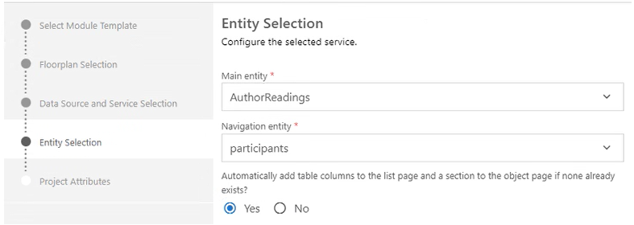
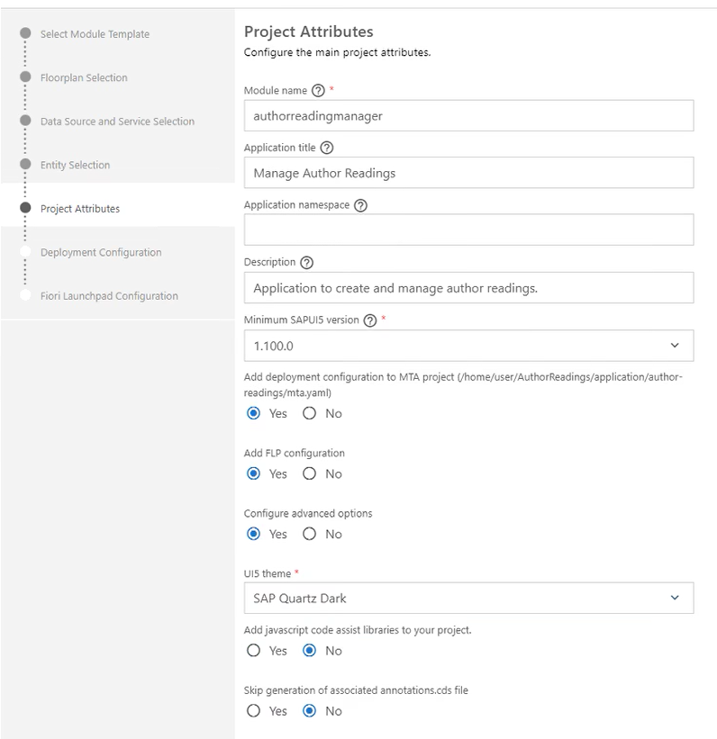
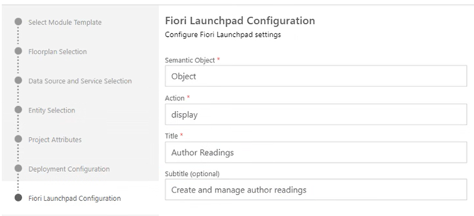
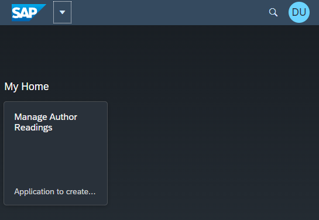

## Initialize New CAP-based Project

First initialize the repository with `CDS` by opening the command line and type **_cds init author-readings_**. This will create a folder with name **_author-readings_** and a set of files to start a CAP project. Navigate into the new folder by typing **_cd author-readings_**. Next add support for MTA and HANA to the project by typing `cds add mta` and `cds add hana`. Last perform an `npm install` to add dependend modules.

https://cap.cloud.sap/docs/guides/deployment/#add-mta-yaml

Further information to the CAP Toolset can be found here: https://cap.cloud.sap/docs/

## Define Entity Models

An entity model is actually a relational data model that will be used on the database by the application.

CAP Documentation of Entity Models: https://cap.cloud.sap/docs/guides/domain-models

All domain models are stored by guidance in the /db folder of the application.

create folder /db

define entity model

- create new file domain-model.cds
- namespace
- reuse components
- ref source file

### Annotations

To add more meta data in ..
https://cap.cloud.sap/docs/advanced/odata#annotations

### Draft Concept

> Explaint in CAP UI section...
> https://cap.cloud.sap/docs/advanced/fiori#draft-support

## Create Testdata

To get started easily let's create some test data which should be available directly after starting the application.

CDS Initial Data: https://cap.cloud.sap/docs/guides/databases#providing-initial-data

## Add Localization Content

Language specific content is stored in standard properties files in corresponding i18n folders.

https://cap.cloud.sap/docs/guides/i18n

create i18n files in db/i18n/i18n.properties
create i18_de/i18n_de.properties

->todo: names?

## Define Services

https://cap.cloud.sap/docs/guides/providing-services

create an /srv folder
create service-models.cds

Create a new file in folder ./srv with file names of the pattern **_<service definition>.js_**

## Create Business Logic

create js file
add handlers for create/read.,..

readings:
create -> set dynamic default values
read -> code values -> constants

participants
create ->
read -> set transient field

reuse functions -> separates file

action implementation handler ohne entity bezug??


## Add Web Application with Fiori Elements
Next we will add an SAP Fiori Element based user interface.

### Fiori Element Application Wizard
This can be done by using a wizard:


Select the Module Template: SAP Fiori Application Template
Select "List Report Object Page"

Select a Data Source and Service as shown below.


Select Entities



and further project attributes



Select "Cloud Foundry" as Target of the Deployment Configuration. For now the destination name is set to "none", it will be configured in a later step in this tutorial.

Last configure the Fiori Launchpad Configuration



and press finish.

The wizard will create a couple of files in the `/app` folder, which is containing all user interface related files.

Now the application can already being started in SAP Business Application Studio. The Fiori Launchpad including the generated tile appears.



### Fine Tune User Interface
Go to `annotations.cds` in the `app/authorreadingmanager` folder....
The wizard added already a field

recommendation for 
- parent-child relationships
- amounts and quantities

- trigger autoloading data in list views
`webapp/manifest.json`


`sap.app` -> `sap.ui5` -> `routing` -> `targets` -> `authorreadingsList` -> `options` -> `settings`
    `"initialLoad" = true`


- remark for color coding
- remark display field as link with dynamic URL


## Add Authentication and role-based authorization
To protect the application for unauthorized access, we add a user based authentication and authorization to the application. Roughly speaking the application defines `Roles` and the assigns these statically to service operations like reading or writing a certain entity. The customer creates `Role Templates`, which group a set of `Roles` and is assigned to named users of the customer. 

See also https://cap.cloud.sap/docs/guides/authorization

First of all the `Roles` should be defined as part of the application definition concept. For the author Reading application we defined two roles: AdminRole, AuthorReadingManager.

The authorization is always defined on service level, in our application on the level of the `/srv/service-models.cds`. For better readeability we seprate the authorization definitions from the service definitions by creating a new file `/srv/service-auth.cds` to contain all authorization relevant model parts.

Next a `xs-security.json` is generated by executing `cds compile srv/ --to xsuaa > xs-security.json`, which contains all runtime relevant security settings of our application. Open the generated file and add 2 `Role Collection` definitions into the top object.

```json
"role-collections": [
    {
      "name": "AuthorReadingManagerRoleCollection",
      "description": "Author Reading Manager",
      "role-template-references": [
          "$XSAPPNAME.AuthorReadingManagerRole"
      ]
    },
    {
      "name": "AuthorReadingAdminRoleCollection",
      "description": "Author Readings Administrator",
      "role-template-references": [
          "$XSAPPNAME.AuthorReadingAdminRole"
      ]            
    }
]
```
		
> Note: Uniqueness of role collections becomes an issue in case of multiple deployments (role collections must be unique within subaccount). This can be achieved by prefixing namespace.

Furthermore make sure the `package.json` contains this part to tell the CDS-framework that we use the XSUAA-Service of the Business Technology Platform.

package.json:
```json
"cds": {
    "requires": {
        "db": {
            "kind": "sql"
        },
        "uaa": {
            "kind": "xsuaa"
        }
    },
    "hana": {
        "deploy-format": "hdbtable"
    }
}
```

Next the `mta.yml` needs to be extended with a new Cloud Foundry service instance definitions and according usages of it in our application. The `mta.yml` had been generated when creating a new CAP project and is containing all deployment relevant information.

Below a snippet from the `mta.yml` focusing on the authorization relevant additions.
```yml
...
modules:
- name: author-readings-srv
  requires:
  - name: author-readings-db
  - name: author-readings-uaa
...
- name: author-readings-db-deployer
  requires:
  - name: author-readings-db
  - name: author-readings-uaa
...
resources:
- name: author-readings-uaa
  type: org.cloudfoundry.managed-service
  parameters:
    path: ./xs-security.json
    service: xsuaa
    service-name: author-readings-uaa
    service-plan: application 
    config:
      xsappname: author-readings-${space} # app name + CF space dependency
      tenant-mode: dedicated
...
```

Next step is to add the node module `passport` to our application project. This can be done by executing `npm add passport`. This statement will download the module and add an according dependency to the applications' `package.json`.

Last we need to define some users and their roles for local testing. This is done in the `.cdsrc.json` file as follows. Here 3 users with name, password and assigned roles are defined.

```json
{
    "auth": {
        "passport": {
            "strategy": "mock",
            "users": {
                "Kate Jacob": {
                    "password": "welcome",
                    "ID": "kjacob",
                    "roles": [
                        "AuthorReadingManagerRole",
                        "authenticated-user"
                    ]
                },
                "Peter Sellers": {
                    "password": "welcome",
                    "ID": "pseller",
                    "roles": [
                        "AuthorReadingAdminRole",
                        "authenticated-user"
                    ]
                },
                "Julia Brunner": {
                    "password": "welcome",
                    "ID": "jbrunner",
                    "roles": [
                        "authenticated-user"
                    ]
                },
                "*": true
            }
        }
    }
}
```

Now the application can be started and a user login popup appears. Log in with one of the 3 defined users and see how the authorization definition works.

> Note: If you would like to switch users, the browser cache needs to be cleared before. This can be for example done in Chrome by pressing CTRL+SHIFT+DEL (or in German: STRG+SHIFT+ENTF), go to `Advanced` and choose a time range and `Passwords and other sign-in data`.

Remarks:
- Dependencies between IAS, IPS, XSUAA, subaccount security settings: TODO
- Authentication recommendations: TODO

## Testing
It is always a good idea to add automatic tests to the application. This can be done by using standard javascript libraries like chai and mocha.
