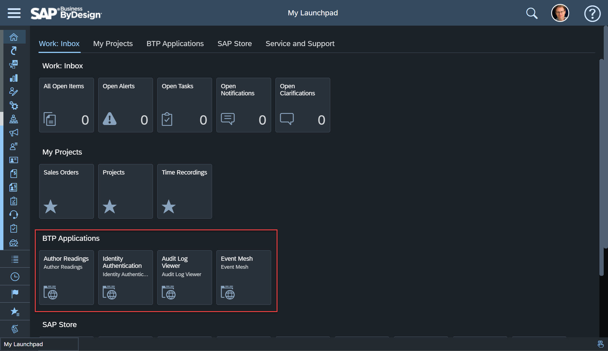
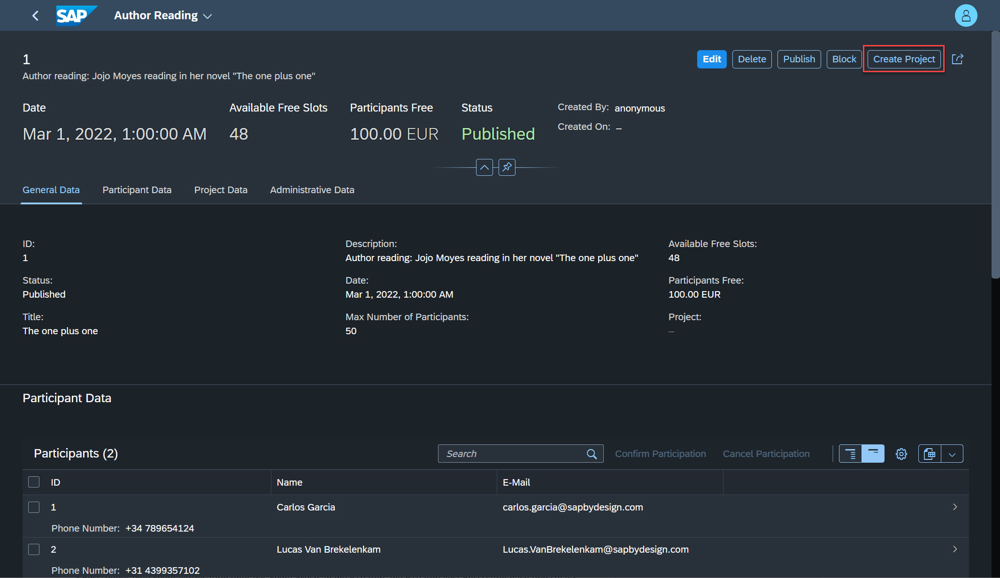
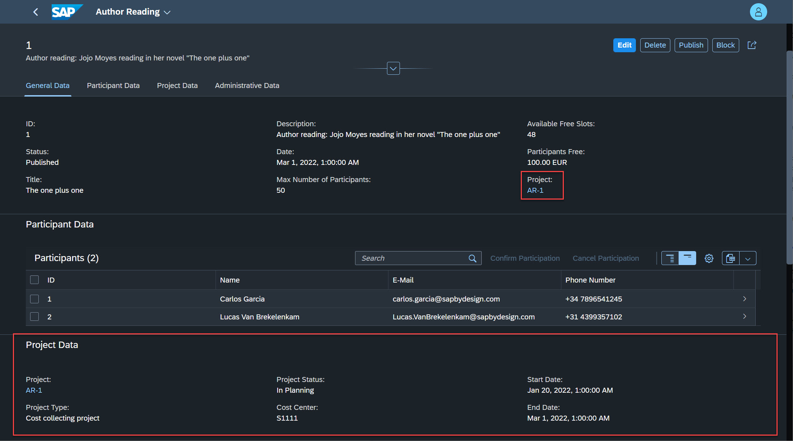
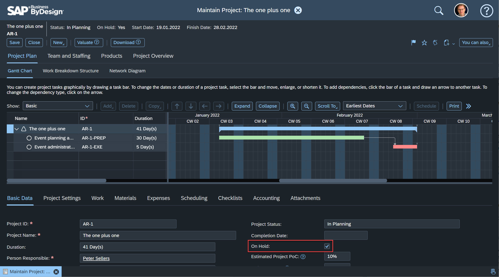

# A Guided Tour to explore the Capabilities of the Sample Application

Step into the shoes of an event manager and assume your job is to organize and run author reading events and poetry slams for reading clubs, book fairs and other occasions. 

Your company is running its business on the SAP system *SAP Business ByDesign* (ByD) and as a project manager your home-base is the work center *Project Management*. You are using ByD projects to plan and staff events, to collect costs and to purchase required equipments. Furthermore you are using the partner application "Author reading management" to publish author reading events and poetry slams and to register participants.

Let's go on a guided tour through the integrated sample solution: 

1. Open ByD using the single sign-on URL (for example https://my123456-sso.sapbydesign.com).
        
    > Note: ByD delegates the user authentication to the *SAP Identity Authentication Service* which acts as corporate identity provider in our example.

2. On the ByD Launchpad you find the partner application "*Author Readings*". Click on the tile to launch the app in a new browser window.
    
    

    > Note: The partner app is embedded on the ByD launchpad using ByD URL mashup capabilities. Additionally you can launch other BTP apps relevant for key users and administrators such as the *Identity Authentication Service* to manage user authentications and authorizations and the *Audit Log Viewer* to review user logins, the read access log and logged changes.
    Launching the partner app does not require to login again because the partner app is linked to your corporate IDP as well and you benefit from single sign-on.

3. In the author reading app you find multiple author readings and poetry slams; some are still in preparation and "Not Released", others are already published. 

    > Note: You see a metadata-driven UI in-line with SAP style guides. Using the *Theme Manager* you can choose your favorite theme. Furthermore you can customize the table layout and adopt the filter area to meet your personal preferences.
    The *Export to Spreadsheet*-function allows you to download the author reading data into Excel. All these capabilities are provided out-of-the-box without development efforts. 

4. Click on one of the author readings with status "Published" to navigate into the author reading details.

5. Click on button "*Edit*" and change the phone number of one of the participants. Then click on button "*Save*" to publish the changes.

    > Note: Your changes are imediately saved to the database as "Draft". Additionally the system locks the author reading for other users to avoid concurrent changes. Only by clicking on "*Save*" you changes become visible to all users and the edit-lock gets released. This provides you sufficient time to make your changes and you may even grab a cup of coffee in between. 

6. Click on button "*Create Project*". In result the system creates a project in ByD based on a project template.

    

    > Note: The app creates the project in ByD using a ByD OData service for projects with user propagation. This means your ByD user authorization apply in the partner application as well; you cannot create a project if your user does not have write-authorizations for ByD projects. 

7. After creating the project you see some brief project details in section *Project Data*. The project ID is displayed as link. Click on the project ID to navigate to the project overview.

    

    > Note: The app mixed-in live project data from ByD (no data replication with delays). The app gets the ByD project data using the ByD OData service for projects using user propagation again and hence this data is only visible if you have the authorization to read projects in ByD.
    The link to launch the ByD project overview is assembled dynamically and uses the ByD hostname of your BTP subaccount configuration as well as the project ID.
    By navigating back to ByD no login is required because of single sign-on.

8. On the ByD project overview click on "*View All*" to navigate to the project GANT-chart. You can see that the project has been created using a template with tasks to plan and run the event and that the project finish date has been taken over from the author reading date. Assume you project lacks sufficient staffing and you need to put the project on hold: Select the checkbox "*On Hold*" in section "*Basic Data*". Save the project changes.

    

    > Note: Saving the project triggers a event notification and ByD sends this event notification to the *SAP Event Mesh*. You can monitor the event notifications in the ByD work center view *Application and User Management - Event Notification Monitoring*.

9. Switch back to the browser window with the author reading app and refresh the browser window. You can see that the status has been changed automatically to "Blocked" to reflect the project status and to avoid further participant registrations.

    > Note: On the *SAP Event Mesh* the BTP application subcribed the ByD project events and triggered the "Block"-action on the author reading instance which is associated to the project. The BTP app retrieves additonal project data from ByD based on the project key provided in the event notification payload. This "call-back" uses the ByD OData service for projects with a technical user because the event-based integration is by design an asychronous integration without business user context.

    > Note: The BTP app itself emits event notifications if author readings are published or blocked. The events are send to the *SAP Event Mesh* to support the integration with 3rd-party applications. We added the event notifications as a short system message in section *Adminitrative Data* for demo purposes. You find the full details and the payload of the event notifications in the *Event Mesh* application.

10. Switch to the ByD launchpad and open the "*Audit Log Viewer*". In the audit log viewer change the from-date to yesterday and click on the "play"-button on the upper right corner. Then enter your name in the filter to search for your own logs.

    > Note: You can see logs of three categories: Security events refer to login- and authentication events, data-access events refer to read access to personal data, and data-modification events refer to data changes. Looking for data-modification events for example, you can find the log entry of the phone number that you changed in step 5.

This concludes the guided tour ... I hope you had an insightful trip :-)