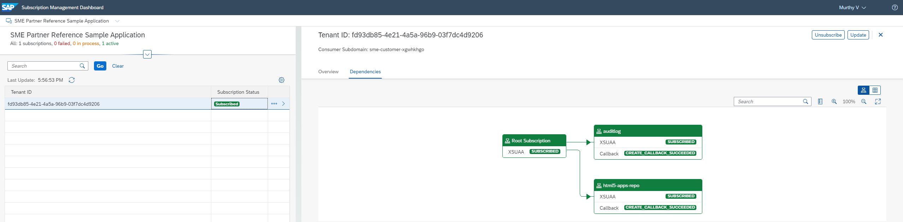
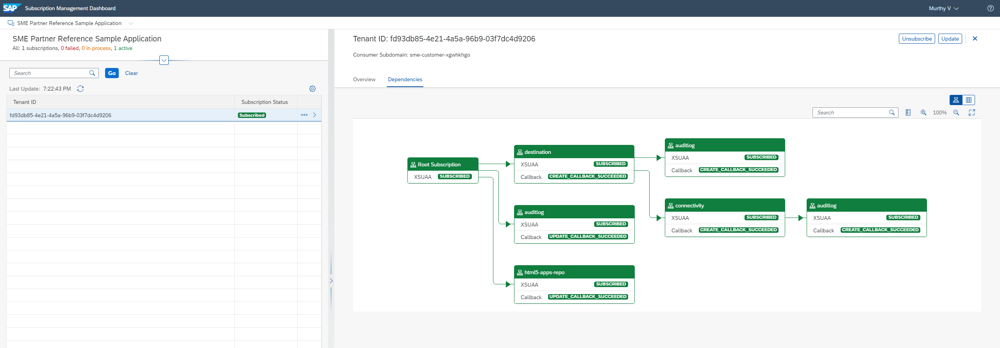

# Enhance the BTP Application for Multi-Tenancy

In our approach of progressive development from a customer-specific single-tenant application to multi-customer application, we keep the single-tenant application as is and start developing the multi-tenant version of the app based on a copy.

*SAP Business Application Studio* (BAS): 
1. Open a terminal and navigate to folder `Applications` using the command `cd Applications/`.
2. Copy the author readings application using the command `cp -R author-readings/ author-readings-mt/`.

In result you have two applications in folder `Applications`:
- The single-tenant version of the Author-Readings app in folder `Applications/author-readings/`, and
- The multi-tenant version of the Author-Readings app in folder `Applications/author-readings-mt/`. 

Both applications use the same names and IDs and therefore cannot be deployed into the same BTP subaccount. Hence, we create new BTP provider and consumer subaccounts for the multi-tenant version of our author readings application to avoid name clashes.

## Enable Multi-Tenancy

The enablement of multi-tenancy basically requires 6 steps:
1. Replace the managed application router provided by SAP Build Work Zone by a custom application router, which we setup as a separate module. 
2. Add and configure the multi-tenant extension module (mtx-module) which handles the subscription and tenant lifecycle processes.
3. Incorporate BTP resources like the Service Manager and the SaaS Provisioning Service to manage and provision multi-tenant applications.
4. Define tenant URL patterns and re-configure routes and destinations accodingly.
5. Adapt the web app entry point to run independent from SAP Build Work Zone.
6. Remove the event-based integration based on the SAP Event Mesh, which does not yet support multi-tenancy. 

In result we will have an application with three separate major modules running on separated workloads:
- the **application services module**, which processes the application services and the web app (the web app could be outsourced in a separate module later as well),
- the **mtx module**, which processes tenant onboarding and other lifecycle operations, and
- the **application router** as single entry point and to manage access to all modules and used services.

### Add Custom Application Router 

For the multi-tenant application we will connect each tenant to the launchpad of the respective ERP solution or the central SAP Build Work Zone launchpad of the respective customer. 
In the light of this setup we simplify our application and replace the usage of a local SAP Build Work Zone instance (which includes a managed application router) by a custom application router.

> Note: This setup is a suitable setup for the single-tenant version of app as well, if no launchpad is required.

*SAP Business Application Studio*: 

1. Add the application router to the web application module. Create file `package.json` in folder `./author-readings-mt/app/` with the following content:
    ```json
    {
        "name": "approuter",
        "dependencies": {
            "@sap/approuter": "^10"
        },
        "engines": {
            "node": "^16"
        },
        "scripts": {
            "start": "node node_modules/@sap/approuter/approuter.js"
        }
    }
    ``` 

2. Add route configuration for the web application. Create file `xs-app.json` in folder `./author-readings-mt/app/` with the following content:
    ```json
    {
        "authenticationMethod": "route",
        "routes": [
            {
                "source": "^/app/(.*)$",
                "target": "$1",
                "localDir": ".",
                "authenticationType": "xsuaa",
                "cacheControl": "no-cache, no-store, must-revalidate"
            },
            {
                "source": "^/(.*)$",
                "target": "$1",
                "destination": "srv-api",
                "authenticationType": "xsuaa",
                "csrfProtection": true
            }
        ]
    }
    ``` 
    > Note: The destination `srv-api` refers to the application router module in file [mta.yaml](../Applications/author-readings-mt/mta.yaml) in the next step.

3. Add application router module to the project deployment configuration. Enhance file [mta.yaml](../Applications/author-readings-mt/mta.yaml) in the project root folder by the following content:
    ```yml
    # Application Router Module
    - name: author-readings-approuter
      type: nodejs
      path: approuter 
      parameters:
        disk-quota: 256M
        memory: 256M
        routes:
        - route: ${approuter-url}.${domain}
        - route: "*.${app-url}.${domain}"
      provides:
      - name: approuter-binding
        properties:
        app-fqdn: ${approuter-url}.${domain}
        app-url: ${protocol}://~{approuter-binding/app-fqdn}  
      requires:
        - name: srv-api
          group: destinations
          properties:
            name: srv-api # Compare ./app/authorreadingmanager/xs-app.json
            url: ~{srv-url}
            forwardAuthToken: true
        - name: author-readings-uaa
        - name: author-readings-destination-service
        - name: author-readings-auditlog
        - name: author-readings-registry
        - name: author-readings-html5-runtime    
      properties:
        TENANT_HOST_PATTERN: "^(.*).${app-url}.${domain}"
        httpHeaders: "[{ \"Content-Security-Policy\": \"frame-ancestors 'self' https://*.hana.ondemand.com\" }]" # Allow the SAP launchpad to host the app in-place    
        CORS:
        - uriPattern: .*
          allowedOrigin:
          - host: "*.${app-url}.${domain}"
            protocol: "https"
    ```
    > Note: The httpHeaders-property allows you to embed the web app in-place in html UIs such as SAP Build Work Zone. Without this setting SAP Build Work Zone raises the error message "… refuse to connect" or "Refused to display '…' in a frame because it set 'X-Frame-Options' to 'sameorigin'" respectively, when opening the web app (click on the app tile). 

    > Note: The application router module refers to the mtx module that we will add in the next step; don't bother about the reference error here.

4. Create new folder `approuter` on root level of project `author-readings-mt`. Move files `./app/package.json` and `./app/xs-app.json` to folder ./approuter`. 
    > Note: By this step we run and configure the application router centrally such that it can be **reused** by multiple web applications (for example if you create a second app for author reading participants later on). Furthermore the appplication router is now ready for **exit implementations** (for example to set specific environment variables, properties, URL header properties like access origins for CORS checks, write log for tracing, ...).

5. Open file `./approuter/xs-app.json` and remove the routes. The xs-app.json only contains generic routes that apply for all web applications. In our example, we have app specific routes only. However, we have to keep the xs-app.json for the application router for project consistency.

6. Adopt file `./app/authorreadingmanager/xs-app.json`. 
The webapplication routes can be configured using the xs-app.json and sample route configuration to access the service api's and html5 ui module can be referred in file `./app/authorreadingmanager/xs-app.json`


### Add Configuration for Multi-Tenancy 

In this step we refactor the project deployment configuration to run a multi-tenant application with subscriptions.

*SAP Business Application Studio*: 

1. Open file `package.json` on the project root level and apply the following changes:
    
    1. Remove the node module dependency to the event mesh:
        ```json
        "dependencies": {
            "@sap/xb-msg-amqp-v100": "^0.9.51",
        }
        ```
    
    2. Add the mtx node module:
        ```json
        "dependencies": {
            "@sap/cds-mtx": "^2"
        }
        ```

    3. Remove the cds-consfiguration related to the event mesh: 
        ```json
        "cds": {
            "requires": {
                "outbound_messaging": {
                    "kind": "enterprise-messaging-shared",
                    "format": "cloudevents",
                    "publishPrefix": "sap/samples/authorreadings/",
                    "webhook": {
                        "waitingPeriod": 60000,
                        "qos": 0
                    }
                },
                "byd_messaging": {
                    "kind": "enterprise-messaging-shared",
                    "queue": {
                        "name": "sap/samples/authorreadings/bydprojectevents"
                    },
                    "webhook": {
                        "waitingPeriod": 60000,
                        "qos": 0
                    }
                }
            }
        }        
         ```
    4. Add the production cds configuration for multi-tenancy:
        ```json
        "cds": {
            "requires": {
                "[production]": {
                    "db": {
                        "kind": "hana-mt"
                    },
                    "auth": {
                        "kind": "xsuaa"
                    },
                    "approuter": {
                        "kind": "cloudfoundry"
                    }
                },
                "multitenancy": true,
            }
        }
        ```

    5. Add the cds configuration for the mtx module:
        ```json
        "cds": {
            "mtx": {
                "element-prefix": "Z_",
                "namespace-blocklist": [],
                "extension-allowlist": []
            }      
        }
        ```
2. Open file [mta.yaml](../Applications/author-readings-mt/mta.yaml) on the project root level and apply the following changes:

    1. Adopt the *Application service module*: Remove the event mesh, add the registry and add the properties for the mtx-module and the application subscription:
        ```yml
            # Service Module
            - name: author-readings-srv
            type: nodejs
            path: gen/srv
            requires:
            - name: author-readings-service-manager
            - name: author-readings-uaa
            - name: author-readings-destination-service
            - name: author-readings-auditlog 
            - name: author-readings-registry 
            provides:
            - name: srv-api
                properties:
                srv-url: ${protocol}://${srv-url}.${domain} # ${default-url}
            - name: srv-multi-tenancy
                properties:
                tenant-delimiter: "."
            parameters:
                buildpack: nodejs_buildpack
                routes:
                - route: ${srv-url}.${domain}
            properties:
                SUBSCRIPTION_URL: ${protocol}://\${tenant_subdomain}.${srv-url}.${domain} # ${default-url}    
        ```

    2. Adopt the *Application router module* for multi-tenancy (Already done when adding the custom application router).

    3. Remove the *DB deployer module*, the *App UI content deployer module* and *App UI resources module*.

    4. Adopt the *Destination content module* and remove the content and parameters refering to the html5 repo host. The resulting *Destination content module* looks like:
        ```yml
        modules:
          # App UI Content Deployer Module (deploy web app content into the HTML5 application repository)
            - name: author-readings-app-deployer
            type: com.sap.application.content
            path: gen
            requires:
            - name: author-readings-html5-repo-host
                parameters:
                content-target: true
            - name: author-readings-uaa
            build-parameters:
                build-result: resources
                requires:
                - artifacts:
                - authorreadingmanager.zip
                name: authorreadingmanager
                target-path: resources/       
        ```

    5. Adopt the *Database resource* for multi-tenancy such that database schemas are created on subscription by the service manager:
        ```yml
        resources: 
          # Service Manager
            - name: author-readings-service-manager
            type: org.cloudfoundry.managed-service
            parameters:
                service: service-manager
                service-plan: container
            properties:
                hdi-service-name: ${service-name}       
        ```    

    6. Adopt the *UUA service resource* for multi-tenancy (tenant-mode): 
        ```yml
        resource:        
          # UAA service (Authorization and Trust Management Service)
            - name: author-readings-uaa
            type: org.cloudfoundry.managed-service
            parameters:
                config:
                tenant-mode: shared
                xsappname: ${xsappname}  
                path: ./xs-security.json
                service: xsuaa
                service-name: author-readings-uaa
                service-plan: broker      
        ```    

    7. Change the parameters of resource *Audit log service* to use service plan *oauth2*.
        ```yml
        resource: 
            # Audit Log Service 
            - name: author-readings-auditlog
            type: org.cloudfoundry.managed-service
            parameters:
                service: auditlog
                service-plan: oauth2 
        ```         

    8. Add the *Service registry* as new resource, which is required for subscription and tenant provisioning:
        ```yml
        resource:
          # Service Registry (SaaS Provisioning Service)
            - name: author-readings-registry
            type: org.cloudfoundry.managed-service
            requires:
                - name: mtx-binding
                - name: approuter-binding
            parameters:
                service: saas-registry
                service-plan: application
                config:
                xsappname: ${xsappname}
                appName: ${xsappname}
                displayName: ${displayname}
                description: ${displayname}
                category: 'Category'
                appUrls:
                    getDependencies: ~{approuter-binding/app-url}/callback/v1.0/dependencies  
                    onSubscription: ~{mtx-binding/app-url}/mtx/v1/provisioning/tenant/{tenantId}
                    callbackTimeoutMillis: 300000        
        ```

    9. Remove the resources *HTML5 app repository* (author-readings-repo-host) and *Event Mesh service* (author-readings-eventmesh).    

    10. Define mtx as separate node module such that tenant lifecycle operations to be done on a separate application to not interfere with the work load of app users.
    Goal: Separating workloads: 1. frontend workload, 2. backend workload, 3. tenant lifecycle operations.

        ```yml
            # Multi Tenancy Service Module (Onboarding, Upgrading)
            - name: author-readings-mtx-srv
            type: nodejs
            path: gen/srv
            requires:
            - name: author-readings-auditlog
            - name: author-readings-uaa
            - name: author-readings-destination-service  
            - name: author-readings-service-manager
                properties:      
                    SUBSCRIPTION_URL: ${protocol}://\${tenant_subdomain}.${app-url}.${domain} # ${default-url}
            parameters:
                routes:
                - route: ${mtx-srv-url}.${domain}
            provides:
            - name: mtx-binding
                properties:
                app-fqdn: ${mtx-srv-url}.${domain}
                app-url: ${protocol}://~{mtx-binding/app-fqdn}  
            - name: author-readings-mtx-srv-destination
                public: true
                properties:
                name: mtx-srv-api
                url: ${protocol}://${mtx-srv-url}.${domain}
                forwardAuthToken: true
            - name: mtx-srv-api # required by consumers of CAP services (e.g. approuter)
                properties:
                mtx-srv-url: ${protocol}://${mtx-srv-url}.${domain} # ${default-url}       
        ```


3. Open file `xs-security.json` on the project root level and apply the following changes:

    1. The scopes, role-templates and role-collections for the application user roles for *athor reading managers* and *author reading administrators* do not change.

    2. Remove the scopes and role-templates for the event-based integration:
        - Scopes: *emcallback*, *emmanagement*
        - Role-template: *emmanagement*

    3. Add scope definitions for multi-tenant lifecycle management (*MtxDiagnose*, *mtcallback*, *mtdeployment*) and for cds model extensions (*ExtendCDS*, *ExtendCDSdelete*):
        ```json
        "scopes": [
            {
                "name": "$XSAPPNAME.MtxDiagnose",
                "description": "Diagnose MTX"
            },
            {
                "name": "$XSAPPNAME.mtcallback",
                "description": "Subscribe to applications",
                "grant-as-authority-to-apps": [
                "$XSAPPNAME(application,sap-provisioning,tenant-onboarding)"
                ]
            },
            {
                "name": "$XSAPPNAME.mtdeployment",
                "description": "Deploy applications"
            },
            {
                "name": "$XSAPPNAME.ExtendCDS",
                "description": "Extend CDS applications"
            },
            {
                "name": "$XSAPPNAME.ExtendCDSdelete",
                "description": "Extend CDS applications with undeployments"
            }        
        ]
        ```

    4. Add role-templates for tenant administration (*MultitenancyAdministrator*) and extension deployment (*ExtensionDeveloper*, *ExtensionDeveloperUndeploy*):
        ```json
        "role-templates": [
            {
                "name": "MultitenancyAdministrator",
                "description": "Administrate multitenant applications",
                "scope-references": [
                "$XSAPPNAME.MtxDiagnose",
                "$XSAPPNAME.mtdeployment",
                "$XSAPPNAME.mtcallback"
                ]
            },
            {
                "name": "ExtensionDeveloper",
                "description": "Extend application",
                "scope-references": [
                "$XSAPPNAME.ExtendCDS"
                ]
            },
            {
                "name": "ExtensionDeveloperUndeploy",
                "description": "Undeploy extension",
                "scope-references": [
                "$XSAPPNAME.ExtendCDSdelete"
                ]
            }     
        ]
        ```

    5. Add authorities for tenant lifecycle operations:
        ```json
        "authorities": [
            "$XSAPPNAME.MtxDiagnose",
            "$XSAPPNAME.mtdeployment",
            "$XSAPPNAME.mtcallback"
        ]            
        ```

4. Delete file `event-mesh.json` from the project root folder.

To verify your modifications check the files in the samle application:
- [package.json](../Applications/author-readings-mt/package.json)
- [mta.yaml](../Applications/author-readings-mt/mta.yaml)
- [xs-security.json](../Applications/author-readings-mt/xs-security.json)


### Adapt the web app entry point to run standalone

The web app entry point (file `../webapp/index.html`) as generated by the Fiori Element application wizard "Create MTA Module from Template" assumes the web app to be embedded in SAP Build Work Zone as "HTML App". However, in our multi-tenancy use case the subscription of the BTP application needs to be embedded in SAP Build Work Zone as "URL App" and in result the web app is running in an iframe of the SAP Build Work Zone launchpad (compare chapter "Add BTP Applications to the ByD Launchpad" in tutorial [Provision Tenants of the Multi-Tenant Application to Customers](Tutorials/45-Multi-Tenancy-Provisioning.md)).  

For this setup we need to adapt the web app index.html file to run standalone app or in-place as URL mashup in an iframe:
1. Open file `./author-readings-mt/app/authorreadingmanager/webapp/index.html`
2. Commend out the shell configuration and the sandbox bootstrap; then add the replacement bootstrap and enhance the body-section to render the application UI. See file [index.html](../Applications/author-readings-mt/app/authorreadingmanager/webapp/index.html) for more details.

> Note: You can easily change the default UI-theme using the attribute `data-sap-ui-theme`. In our example we created the web application originally with default theme "SAP Quartz Dark" (`data-sap-ui-theme="sap_fiori_3_dark"`) and now we switch to theme "SAP Morning Horizon" (`data-sap-ui-theme="sap_horizon"`).

### Remove business logic for the event-based Integration

Remove the service implementation to emit event notifications and to implement ERP events.

*SAP Business Application Studio*: 

1. Open file `./author-readings-mt/srv/service-implementation.js` and comment out the code section *"Event-based integration with ByD"*.

2. Open file `./author-readings-mt/srv/reuse.js` and comment out the code within function `emitAuthorReadingEvent` (see code section *"Emit event message to event mesh"*). Keep the fucntion definition itself, because the function is used in the service implementation.

To verify your modifications check the files in the samle application:
- [service-implementation.js](../Applications/author-readings-mt/srv/service-implementation.js)
- [reuse.js](../Applications/author-readings-mt/srv/reuse.js)

### Support and Maintainance

#### Issue: Not able to connect to ERP via BTP destination

Symptom: 
- Destination to ERP is maintained correctly in BTP subaccount , BTP application raises the error message bad gateway.
- User can retrieve the log using command `cf logs {service-name}`, for example: `cf logs author-readings-srv`.
- In the above case, you get the following error in the log: *Error during request to remote service: Could not fetch client credentials token for service of type "destination"*

Root cause analysis: 
1. Navigate to the *Subscription Management Dashboard*
2. Select the subscribed application from the subscription list
3. Navigate to the *Details* section and the dependencies subsection
4. Check the dependencies of the application and observe that the destination service is missing in the dependencies list.
  

Solution : 

Add the destination service as part of dependencies of Approuter and mtx module in deployment descriptor file mta.yaml and redeploy the application.

In detail: 
Open the [mta.yaml](../Applications/author-readings-mt/mta.yaml) file, and check the *Application Router Module* `author-readings-approuter` and the *Multi Tenancy Service Module* `author-readings-mtx-srv`. Both should refer to the destination service `author-readings-destination-service` in the requires-section: 
```yml
modules:
# Application Router Module
- name: author-readings-approuter
  requires:
  - name: author-readings-destination-service    

# Multi Tenancy Service Module (Onboarding, Upgrading)
- name: author-readings-mtx-srv
  requires:
  - name: author-readings-destination-service    
```        
After the successful update and re-deployment, the dependencies should as follows: 
      

> Note: After the above changes and successfull deployment of the application, make sure to perform the action *Update* dependencies (click on the "Update"-button in the details section) of the *Subscription Management Dashboard*.
