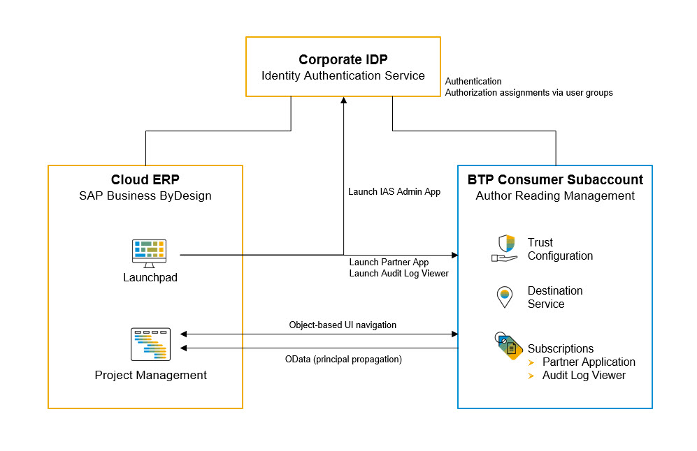
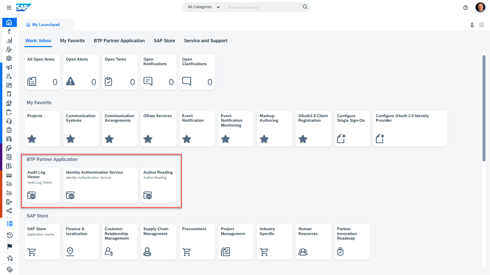

# Provision Tenants of the Multi-Tenant Application to Customers

Our goal is to provide our multi-customer application as "partner-managed application". For this purpose we create consumer subaccounts for each customer in the BTP global account of the partner that hosts the provider subaccount as well. Then we subscribe the multi-tenant BTP application in the consumer subaccount and connect the customers ERP system and the corporate identity provider.

As result of this setup, all customers use shared BTP resources like the Cloud Foundry runtime and the HANA cloud service. At the same time the BTP multi-tenancy ensures a secure separation of customer data (by DB schemas) and user access management.

## Setup BTP Consumer Subaccount

We start the provisioning proceedure by creating a BTP consumer subaccount for a specfic customer.

1. Open the *BTP Cockpit* (the same global account that hosts the provider subaccount of the BTP application) and create a new *Multi-Environment*-Subaccount with some name refering to the tenant number or the customer. As provider we choose *Amazon Web Services (AWS)*. In our example we name the subaccount "AuthorReadings MT Subscriber 1" 

2. BTP Cockpit (global account level): Assign the following entities to the consumer subaccount:
    - *Audit Log Viewer Service*, service plan *default (Application)*

### Subscribe the BTP Multi-Tenant Application

Now we subscribe our own BTP application and related administrative BTP applications such as the audit log viewer.

3. BTP Cockpit (consumer subaccount): Navigate to the *Instances and Subscriptions* and create subscriptions for the following applications: 
    - *SME Partner Reference Sample Application*, service plan *default* (this is our own multi-tenant BTP application)
    - *Audit Log Viewer Service*, service plan *default (Application)*

You can launch the BTP application and the audit log viewer using the following URLs:

- **BTP Application Tenant URL**: Navigate to *Instances and Subscriptions* and concatenate the URL provided by application *SME Partner Reference Sample Application* via button *Go to Application*, and the path of the web application `/authorreadingmanager/`.

- **Audit Log Viewer URL**: Navigate to *Instances and Subscriptions* and launch the application "Audit Log Viewer Service" using button "Go to Application". 

### Setup Single Sign-on for the BTP Application Subscription

We use the *SAP Identity and Authentication Service* (IAS) as corporate identity provider (IDP) and establish a trust relationship between the service provider (our BTP consumer subaccount) and the IAS tenant. In result the BTP consumer subaccount and our application delegates user authentications to the IAS tenant incl. single sign-on. Furthermore, we use the IAS tenant to assign authorization roles to users via user groups.

Precondition: You have admin access to an *SAP Identity and Authentication Service* tenant.

#### Configure Trust using SAML 2.0

Setup the trust relationship between the BTP subaccount to IAS using SAML 2.0. 

> Note: Typically the BTP consumer subaccount is assigned to the partner and the IAS tenant is assigned to the customer such that a trust configuration using Open ID Connect (OIDC) is not possible, and therefore we use the SAML protocol for the trust relationship. If the provider subaccount, the consumer subaccount and the IAS tenant are all assigned to the customer, then OIDC is the prefered approach to configure trust; follow the instruction in chapter [Open ID Connect Configuration](Tutorials/03-One-Off-Deployment.md) in this case.

BTP consumer subaccount:

1. Download the **Service provider SAML metadata file**: Open menu item *Security* >> *Trust Configuration* and click on *Download SAML Metadata*.

IAS Admin UI:
	
2. Open menu item *Applications* under *Applications & Resources* and create a new application of type *Bundled application*.
	- Enter the required information like application display name, application URL, … The display name appears on user login screen and the login applies to all applications linked to the IAS tenant (following the SSO principle). Choose something meaningful text from an end-user point of view representing the scope of the IAS, for example "Almika Inc. - Author Readings" or something more general if you subscribed multiple apps in your consumer subaccount.
	- Open section *SAML 2.0 Configuration* and upload the **Service provider SAML metadata file** from the BTP subaccount.
	- Open section *Subject Name identifier* and select "E-Mail" as basic attribute.
	- Open section *Default Name ID Format* and select "E-Mail".
    - Open section *Assertion Attributes* and add the user attribute *Groups* with value "Groups"
        > Note: The assertion attribute *Groups* is used to process authorization checks in the consumer subaccount based on user groups. The value "Groups" of the assertion attribute needs to be written with a capital "G" for BTP subaccounts!

3. Download the **IDP SAML metadata file**: Open menu item *Applications & Resources* >> *Tenant Settings* >> *SAML 2.0 Configuration* and click on *Download Metadata File* (the button in the lower left corner).

BTP consumer subaccount:

4. Open menu item *Security* >> *Trust Configuration* and click on *New Trust Configuration*. Upload the **IDP SAML metadata file** and enter a meaningful name and description for the IDP (for example "Corporate IDP" or "Custom IAS (SAML2.0)").

#### Configure Authorization Roles 

We are using IAS user groups to assign authorizaton roles to users. The user groups will be passed as assertion attribute to the BTP consumer subaccount and will be mapped to respective role collections in the subaccount. 

IAS Admin UI:

1. Open menu item *User Management* under *Users & Authorizations* and add the users who shall have access to the BTP application. Enter user details like name and e-mail and take into account that the e-mail is used as identifying attribute (use the same e-mail address in all related systems incl. IAS, ERP system, ...).
	
2. Open menu item *User Groups* under *Users & Authorizations* and add user groups that represent typical user roles and enter a unique (technical) *Name* and a meaningful *Display Name*, for example:

    | Name:                      | Display name:              |
    | :------------------------- | :------------------------- |
    | AuthorReadingManager       | Author Reading Manager     |
    | Admin                      | Administrator              |
   > Note: add *users* to the user group by clicking on *Add* button and select the user from the list of users and click on *Save*.

3. Open menu item *Applications* under *Applications & Resources*, open the application referring to the BTP consumer subaccount, and navigate to *Assertion Attributes*. 
Check if the *User Attribute* "Groups" is already mapped to the *Assertion Attribute* "Groups". If not, then add the attribute mapping.

BTP consumer subaccount:

4. Open menu item *Role Collections* and create a new role collection with name "Auditor" and assign the roles *Auditlog_Auditor*.

5. Open menu item *Role Collections* and add the user groups (using the unique technical name of the user group) to the role collections that shall be assigned to the respective users with the use group:

    | Role Collection:                   | User Groups:         |
	| :---                               | :---                 |
	| AuthorReadingManagerRoleCollection | AuthorReadingManager |
	| AuthorReadingAdminRoleCollection   | Admin                |
    | Auditor                            | Admin                |
    | Subaccount Administrator           | Admin                |
    | Destination Administrator          | Admin                |

6. Test the login using single sign-on: Launch the BTP application and select the IAS tenant as IDP. 

    > Note: The first attempt to open the app may fail with an authorization error message if the user has not yet been replicated from the IAS tenant to the BTP consumer subaccount (latest at this point this replication is triggered and executed automatically). The second login attempt to open the app should be successful always.

You may deactivate the user login with the *Default Identity Provider* (which refers to the *SAP ID Service*) in the *Trust Configuration* of your BTP consumer subaccount. In result end users cannot select the *Default Identity Provider* and the customers IAS tenant is used for authentication automatically.

## Connect the BTP Application to *SAP Business ByDesign*

In this chapter we connect a *SAP Business ByDesign* tenant (representing the customers cloud ERP system), the IAS tenant (acting as corporate IDP), and the BTP consumer subaccount (with the customer subscription of the partner application).

Frontend integration:

1. Launch the BTP app from the ByD launchpad,
2. Launch BTP administration applications such as the IAS admin application and the audit log viewer from the ByD launchpad,
3. Navigate from the BTP application to related ByD projects (ByD Project Management),
4. Single sign-on for ByD, the BTP app and all BTP admin apps using the same customer IAS tenant as IDP.

Back-channel integration:

5. Create and read ByD projects from the BTP app using OData APIs with principal propagation,

### Configure Single Sign-on for ByD

We use the *SAP Identity and Authentication Service* (IAS) as corporate identity provider (IDP) and establish a trust relationship between the service provider (our ByD tenant) and the IAS tenant. In result ByD delegates user authentications to the IAS tenant incl. single sign-on. 

We setup the trust relationship between ByD and IAS using SAML 2.0 and we use e-mail to identify the user.
Therefore, make sure the same e-mail addresses are entered for users in ByD as well as in the IAS tenant.

IAS Admin UI:

1. Download the **IDP SAML metadata file**: Open menu item *Tenant Settings* >> *SAML 2.0 Configuration* and click on *Download Metadata File* (the button in the lower left corner).

ByD:

2. Open work center *Application and User Management* and navigate to *Common Tasks* >> *Configure Single Sign-on*.
3. Go to the *Identity Provider* sheet, and in the list *Trusted Identity Provider*, click on the button *New Identity Provider*. 
4. Upload the **IDP SAML metadata file** which you downloaded from IAS tenant. 
5. Enter a suitable name for the IDP as *Alias*. The alias is displayed in the selection screen to choose an IDP in case you configure multiple identity provider in ByD.   
6. In the list under *Supported Name ID Formats*, add "E-Mail Address" as additional *Name Id Format* and use the *Actions*-button to select the e-mail address as *default name ID format*. 
7. Click on the *Save* button on the header of the UI. 
8. Click on the *Activate Single Sign-On* button on the header of the UI. 
9. Navigate to sheet *My System* and click on button *SP Metadata* to download the **ByD Service provider SAML metadata file**.

IAS Admin UI:

10. Open menu item *Applications* and create a new application of type *Bundled application*.
	- Enter the required information like application display name, application URL, … The display name appears on user login screen and the login applies to all applications linked to the IAS tenant (following the SSO principle). Choose some meaningful display name from an end-user point of view representing the scope of the IAS, for example "Almika Inc. - User login" or "Almika Inc. - ByD user authentication". As application URL you may use the ByD access URL for single sign-on, for example https://myXXXXXX-sso.sapbydesign.com.
	- Open section *SAML 2.0 Configuration* and upload the **ByD Service provider SAML metadata file** that you downloaded from ByD.
	- Open section *Subject Name identifier* and select "E-Mail" as basic attribute.
	- Open section *Default Name ID Format* and select "E-Mail".

Test the ByD user authentication with single sign-on:

11. Open the SSO access URL of ByD (for example https://myXXXXXX-sso.sapbydesign.com) in an incognito browser window and check if ByD redirects to the IAS login screen for user authentication. Use your e-mail and the IAS-password and check if the login to ByD is processed successfully.

### Expose ByD Projects as OData Service

In our sample BTP application we read and write ByD projects using the *Custom OData Service* "khproject".

Create the *Custom OData Service* "khproject":
1. Download the sample *Custom OData Service* "khproject" from GitHub repository [SAP Business ByDesign - API Samples](https://github.com/SAP-samples/byd-api-samples). 
2. Open the ByD work center view *Application and User Management - OData Services*, select *Custom OData Services* and upload the *Custom OData Service*.
3. Refresh the table of custom OData services and open the OData service "khproject" by clicking on *Edit*.
4. Take note of the *Service URL* which provides the service metadata as **ByD khproject metadata** for later reference. 

> Note: The GitHub repository mentioned above offers a Postman collection with examples to explore and test the ByD OData service as well.

### Configure OAuth-Authentication for OData Services

We are using *OAuth 2.0 SAML Bearer authentication* to access the ByD OData service to read and write ByD projects with the user-context initiated by the user on the UI of the BTP application. In result ByD user authorizations apply on the BTP application as well. Users without the permission to manage projects in ByD can still open the BTP application, but ByD project data is not retrieved and projects cannot be created.

Steps to configure ByD for *OAuth 2.0 SAML Bearer authentications*:

BTP consumer subaccount: Get the signing certificate of the BTP UAA service as OAuth Identity provider:

1. Open the menu item *Connectivity* >> *Destinations*, click on *Download Trust* and save the file with the signing certificate. Change the file name using ".cer" as file extension, for example "btp-signing-certificate.cer".
2. Open the file with the signing certificate and take note of the "Issued by"-name.

> Note: In result you have a file with the **BTP subaccount signing certificate** (with file extension ".cer") and the **BTP subaccount service provider name**, referred to as "Issued by" in the BTP subaccount signing certificate. Keep them both for later reference.

ByD: Configure an *OAuth 2.0 Identity Provider*:

3. Open the ByD work center *Application and User Management* and the common task *Configure OAuth 2.0 Identity Providers*.
4. Create new *OAuth 2.0 Identity Provider*:
	- *Issuing Entity Name*: Enter the **BTP subaccount service provider name** noted in step 1
	- *Primary Signing Certificate*: Browse and upload the **BTP subaccount signing certificate** (".cer"-file)
	- Check indicator *Email Address*
5. Enter an *Alias* for the new *OAuth 2.0 Identity Provider*, for example "Author Reading Runtime"
6. Save

ByD: Add an *OAuth2.0 Client Registration*:

7. Open the ByD work center view *Application and User Management – OAuth2.0 Client Registration* and create a new *OAuth2.0 Client Registration*:
	- *Client ID*: Note the *Client ID* generated by the system as **ByD OAuth Client ID**.
	- *Client Secret*: Enter a secure password and note the password as **ByD OAuth Client Secret**.
	- *Description*:  Enter some meaningful description.
	- *Issuer Name*: Select the *OAuth 2.0 Identity provider* created just before. 
	- *Scope*: Selecting scope ID “UIWC:CC_HOME” should be sufficient for most use cases. Note the scope as **ByD OAuth Scope**

ByD: Get ByD service provider name:

8. Open the ByD work center *Application and User Management* and common task *Configure Single Sign-On*. On sheet *My System* take note of the *Local Service Provider* as **ByD service provider name**.

ByD: Download the ByD server certificate:

9. Open the ByD UI (here using Chrome as browser) and click on the lock icon *View site information* on the left side of the URL and export the **ByD server certificate** as Base-64 encoded "X.-509"-file

> Note: Keep your notes and the ByD server certificate file; you will need them when configuring the destinations in the BTP provider subaccount after completing the code enhancements of your BTP application.

### Setup Destinations to connect the BTP App to ByD 

BTP consumer subaccount: Create destination "byd" to connect to ByD with principal propagation:

1. Open the menu item *Connectivity* of the BTP consumer subaccount, click on *Destinations* and create a *New Destination* with the following field values:

    | Parameter name:           | Value:                                                                                 |
    | :------------------------ | :------------------------------------------------------------------------------------- |
    | *Name*:                   | *byd*                                                                                  |
    | *Type*:                   | *HTTP*                                                                                 |
    | *Description*:            | Enter a destination description, for example "*ByD 123456 with principal propagation*" |
    | *URL*:                    | *https://{{ByD-hostname}}* for example “*https://my123456.sapbydesign.com*”            |
    | *Proxy Type*:             | *Internet*                                                                             |
    | *Authentication*:         | *OAuth2SAMLBearerAssertion*                                                            |
    | *Audience*:               | Enter the **ByD service provider name**                                                |
    | *AuthnContextClassRef*:   | *urn:none*                                                                             |
    | *Client Key*:             | Enter the **ByD OAuth Client ID**                                                      |
    | *Token Service URL*:      | *https://{{ByD-hostname}}/sap/bc/sec/oauth2/token*                                     |
    | *Token Service User*:     | Enter the **ByD OAuth Client ID**                                                      |
    | *Token Service Password*: | Enter the **ByD OAuth Client Secret**                                                  |

    Enter the Additional Properties:
    
    | Property name:  | Value:                                                   |
    | :-------------- | :------------------------------------------------------- |
    | *nameIdFormat*: | *urn:oasis:names:tc:SAML:1.1:nameid-format:emailAddress* |
    | *scope*:        | Enter the **ByD OAuth Scope** (*UIWC:CC_HOME*)           |
    | *userIdSource*: | *email*                                                  |

    > Note: You may need to upload the ByD server certificate into the destination service for SSL authentication using the link *Upload and Delete Certificates* on the destinations screen. You can download the ByD server certificate from the brower (Open the ByD UI and view the site information; then display and export the certificate details into a ".cer"-file).

BTP consumer subaccount: Create destination "byd-url" to launch ByD screens. 

The destination "byd-url" is used to store the single sign-on URL of the ByD system. By storing the base-URL in a destination, we make sure that connecting the BTP web application to ByD systems is a pure configuration task and does not require any code changes.

At runtime we dynamically assemble the parameterized URL to launch the ByD project overview ("referred to as *external object-based navigation* in ByD) by concatenating this base-URL with the ByD-floorplan-specific path and the object-specific parameters (for example the project ID). The authentication method is not relevant in this destination and therefore we choose "NoAuthentication" for simplicity (of course this destination cannot be used to use any ByD service directly).

4. Open the menu item *Connectivity* of the BTP consumer subaccount, click on *Destinations* and create a *New Destination* with the following field values:

    | Parameter name:   | Value:                                                                                  |
    | :---------------- | :-------------------------------------------------------------------------------------- |
    | *Name*:           | *byd-url*                                                                               |
    | *Type*:           | *HTTP*                                                                                  |
    | *Description*:    | Enter a destination description, for example "*ByD 123456 URL*"                         |
    | *URL*:            | *https://{{ByD-hostname-for-SSO}}*, for example “*https://my123456-sso.sapbydesign.com*” |
    | *Proxy Type*:     | *Internet*                                                                              |
    | *Authentication*: | *NoAuthentication*                                                                      |
    
### Add BTP Applications to the ByD Launchpad

As last step we add the BTP application subscription for author readings and BTP admin apps to the ByD launchpad such that author reading managers as well as system administrators can launch all relevant apps from a single launchpad.

Create mashup for the BTP application subscription "Author Readings":

1. Launch the **BTP Application Tenant URL** and copy the link address of the application "Manage Author Readings" (we want to launch the app directly w/o the BTP launchpad). 

2. ByD: Open work center view *Application and User Management - Mashup Authoring* and create a new URL mashup with the following data:
	- *Port Binding Type*: Select *1 - Without Port Binding*
	- *Mashup Name*: "Author Readings"
	- *Description*: "Manage author readings and poetry slams"
	- *URL*: Enter the URL of the web application from step 1
	- *HTTP Method*: Select *Get*

Create a mashup for the IAS Admin application:

3. ByD: Open work center view *Application and User Management - Mashup Authoring* and create a new URL mashup with the following data:
	- *Port Binding Type*: Select *1 - Without Port Binding*
	- *Mashup Name*: "Identity Authentication Service"
	- *Description*: "Manage user authorizations and user groups"
	- *URL*: Enter the URL of the IAS admin UI following the pattern https://<IAS hostname>/admin/
	- *HTTP Method*: Select *Get*

Create a mashup for the Audit Log Viewer:

6. BTP consumer subaccount: Get the URL of the Audit log viewer: Open menu item *Instances and Subscriptions* and pick the URL of the *Application* "Audit Log Viewer Service".

7. ByD: Open work center view *Application and User Management - Mashup Authoring* and create a new URL mashup with the following data:
	- *Port Binding Type*: Select *1 - Without Port Binding*
	- *Mashup Name*: "Audit Log Viewer"
	- *Description*: "View audit logs"
	- *URL*: Enter the URL of the Audit log viewer application. 
	- *HTTP Method*: Select *Get*
	
Add the BTP apps to the ByD Launchpad:
	
8. ByD: Open work center view *Home - My Launchpad* and start the personalization mode by selecting *Start Personalization Mode* from the *Me Area* menu in the top shell bar. Choose the best fitting launchpad group (or create a new group), click on "+", and pin the tiles refering to the mashups created above from the mashup gallery to the launchpad. Finally, save and stop the peronalization mode.

9. Test frontend SSO: Open ByD using the SSO-URL (following the pattern https://myXXXXXX-sso.sapbydesign.com/) and login using your IAS user. Then launch the BTP application via the ByD launchpad. No additional authentication should be required.

> Note: If the SAP Launchpad raises the error message *"[…] refuse to connect"* or *"Refused to display '[…]' in a frame because it set 'X-Frame-Options' to 'sameorigin'"* on opening the web app (click on the app tile), then add the property `httpHeaders: "[{ \"Content-Security-Policy\": \"frame-ancestors 'self' https://*.hana.ondemand.com\" }]"` to the application router module in your `mta.yaml` file. See tutorial [Enhance the BTP Application for Multi-Tenancy](Tutorials/40-Multi-Tenancy.md) for more details.

## Create Users and Assign Authorizations

In our app design we rely on the business users and authorizations being created and managed in the Cloud ERP solution (here: *SAP Business ByDesign*) and the customers identity provisioning provider (here: *Identity Authentication Service*).
As a general approach you create the user in the ERP solution and the IdP, and then assign the user group that includes the authorization to the partner application to the user.

Step for *SAP Business ByDesign* as Cloud ERP:
1. ByD: Hire an *Employee* or create a *Service Agent* in the *SAP Business ByDesign* system (for service agents, you need to trigger the creation of a user). Make sure to maintain the e-mail address for in-house communication of the employee or service agent (this e-mail is used as user identifying attribute for single sign-on).
2. ByD: Edit the business user and assign relevant work centers (incl. the work center *Project Management*).
3. IAS: Create the same user in the *Identity Authentication Service* system and enter the same e-mail address used in the ByD system.
4. IAS: Assign the user group with the authorization for BTP application (for example the user group *Admin* or *AuthorReadingManager*) to the user.

> Note: Make sure to maintain the same e-mail address for users in the Cloud ERP and the IAS tenant. Otherwise single sign-on and the API-led integration using OAuth SAML bearer does not work.

## Remarks and Troubleshooting

Subscriptions can be deleted in the consumer subaccount.
If you delete and recreate a subscription of the BTP application, all consumer subaccount configurations (trust/SSO, destinations, ...) remain valid except the user groups in the role collections. You may observe a "404 - Unauthorized" error message when accessing the BTP application, if you missed to add the user groups to the role collections of the BTP application after re-subscribing the BTP application.

Never remove the multi-tenant application in the provider subaccount without deleting all subscriptions first.
If you accidentially deleted an application with existing subacriptions, then these subscriptions cannot be deleted because off-boarding proceedures cannot be processed. Send a support request to SAP to remove such dead-end subscriptions. 
