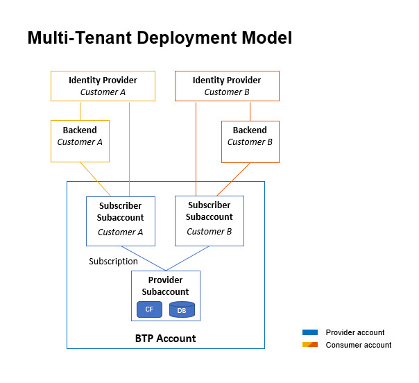

# Provision Tenants of the Multi-Tenant Application to Customers

Our goal is to provide our multi-customer application as "partner-managed application". For this purpose we create consumer subaccounts for each customer in the BTP global account of the partner that hosts the provider subaccount as well. Then we subscribe the multi-tenant BTP application in the consumer subaccount and connect the customers ERP system and the corporate identity provider.

As result of this setup, all customers use shared BTP resources like the Cloud Foundry runtime and the HANA cloud service. At the same time the BTP multi-tenancy ensures a secure separation of customer data (by DB schemas) and user access management.

## Setup BTP Consumer Subaccount

We start the provisioning proceedure by creating a BTP consumer subaccount for a specfic customer.

1. Open the *BTP Cockpit* (the same global account that hosts the provider subaccount of the BTP application) and create a new *Multi-Environment*-Subaccount with some name refering to the tenant number or the customer. As provider we choose *Amazon Web Services (AWS)*. In our example we name the subaccount "AuthorReadings MT Subscriber 1" 

2. BTP Cockpit (global account level): Assign the following entities to the consumer subaccount:
    - *Audit Log Viewer Service*, service plan *default (Application)*

### Subscribe the BTP Multi-Tenant Application

Now we subscribe our own BTP application and related administrative BTP applications such as the audit log viewer.

3. BTP Cockpit (consumer subaccount): Navigate to the *Instances and Subscriptions* and create subscriptions for the following applications: 
    - *SME Partner Reference Sample Application*, service plan *default* (this is our own multi-tenant BTP application)
    - *Audit Log Viewer Service*, service plan *default (Application)*

You can launch the BTP application and the audit log viewer using the following URLs:

- **BTP Application Tenant URL**: Navigate to *Instances and Subscriptions* and concatenate the URL provided by application *SME Partner Reference Sample Application* via button *Go to Application*, and the path of the web application `/authorreadingmanager/`.

- **Audit Log Viewer URL**: Navigate to *Instances and Subscriptions* and launch the application "Audit Log Viewer Service" using button "Go to Application". 

### Setup Single Sign-on for the BTP Application Subscription

We use the *SAP Identity and Authentication Service* (IAS) as corporate identity provider (IDP) and establish a trust relationship between the service provider (our BTP consumer subaccount) and the IAS tenant. In result the BTP consumer subaccount and our application delegates user authentications to the IAS tenant incl. single sign-on. Furthermore, we use the IAS tenant to assign authorization roles to users via user groups.

Precondition: You have admin access to an *SAP Identity and Authentication Service* tenant.

#### Configure Trust using SAML 2.0

Setup the trust relationship between the BTP subaccount to IAS using SAML 2.0. 

> Note: Typically the BTP consumer subaccount is assigned to the partner and the IAS tenant is assigned to the customer such that a trust configuration using Open ID Connect (OIDC) is not possible, and therefore we use the SAML protocol for the trust relationship. If the provider subaccount, the consumer subaccount and the IAS tenant are all assigned to the customer, then OIDC is the prefered approach to configure trust; follow the instruction in chapter [Open ID Connect Configuration](Tutorials/03-One-Off-Deployment.md) in this case.

BTP consumer subaccount:

1. Download the **Service provider SAML metadata file**: Open menu item *Security* >> *Trust Configuration* and click on *Download SAML Metadata*.

IAS Admin UI:
	
2. Open menu item *Applications* under *Applications & Resources* and create a new application of type *Bundled application*.
	- Enter the required information like application display name, application URL, … The display name appears on user login screen and the login applies to all applications linked to the IAS tenant (following the SSO principle). Choose something meaningful text from an end-user point of view representing the scope of the IAS, for example "Almika Inc. - Author Readings" or something more general if you subscribed multiple apps in your consumer subaccount.
	- Open section *SAML 2.0 Configuration* and upload the **Service provider SAML metadata file** from the BTP subaccount.
	- Open section *Subject Name identifier* and select "E-Mail" as basic attribute.
	- Open section *Default Name ID Format* and select "E-Mail".
    - Open section *Assertion Attributes* and add the user attribute *Groups* with value "Groups"
        > Note: The assertion attribute *Groups* is used to process authorization checks in the consumer subaccount based on user groups. The value "Groups" of the assertion attribute needs to be written with a capital "G" for BTP subaccounts!

3. Download the **IDP SAML metadata file**: Open menu item *Applications & Resources* >> *Tenant Settings* >> *SAML 2.0 Configuration* and click on *Download Metadata File* (the button in the lower left corner).

BTP consumer subaccount:

4. Open menu item *Security* >> *Trust Configuration* and click on *New Trust Configuration*. Upload the **IDP SAML metadata file** and enter a meaningful name and description for the IDP (for example "Corporate IDP" or "Custom IAS (SAML2.0)").

#### Configure Authorization Roles 

We are using IAS user groups to assign authorizaton roles to users. The user groups will be passed as assertion attribute to the BTP consumer subaccount and will be mapped to respective role collections in the subaccount. 

IAS Admin UI:

1. Open menu item *User Management* under *Users & Authorizations* and add the users who shall have access to the BTP application. Enter user details like name and e-mail and take into account that the e-mail is used as identifying attribute (use the same e-mail address in all related systems incl. IAS, ERP system, ...).
	
2. Open menu item *User Groups* under *Users & Authorizations* and add user groups that represent typical user roles and enter a unique (technical) *Name* and a meaningful *Display Name*, for example:

    | Name:                      | Display name:              |
    | :------------------------- | :------------------------- |
    | AuthorReadingManager       | Author Reading Manager     |
    | Admin                      | Administrator              |
   > Note: add *users* to the user group by clicking on *Add* button and select the user from the list of users and click on *Save*.

3. Open menu item *Applications* under *Applications & Resources*, open the application referring to the BTP consumer subaccount, and navigate to *Assertion Attributes*. 
Check if the *User Attribute* "Groups" is already mapped to the *Assertion Attribute* "Groups". If not, then add the attribute mapping.

BTP consumer subaccount:

4. Open menu item *Role Collections* and create a new role collection with name "Auditor" and assign the roles *Auditlog_Auditor*.

5. Open menu item *Role Collections* and add the user groups (using the unique technical name of the user group) to the role collections that shall be assigned to the respective users with the use group:

    | Role Collection:                   | User Groups:         |
	| :---                               | :---                 |
	| AuthorReadingManagerRoleCollection | AuthorReadingManager |
	| AuthorReadingAdminRoleCollection   | Admin                |
    | Auditor                            | Admin                |
    | Subaccount Administrator           | Admin                |
    | Destination Administrator          | Admin                |

6. Test the login using single sign-on: Launch the BTP application and select the IAS tenant as IDP. 

    > Note: The first attempt to open the app may fail with an authorization error message if the user has not yet been replicated from the IAS tenant to the BTP consumer subaccount (latest at this point this replication is triggered and executed automatically). The second login attempt to open the app should be successful always.

You may deactivate the user login with the *Default Identity Provider* (which refers to the *SAP ID Service*) in the *Trust Configuration* of your BTP consumer subaccount. In result end users cannot select the *Default Identity Provider* and the customers IAS tenant is used for authentication automatically.

## Remarks and Troubleshooting

Subscriptions can be deleted in the consumer subaccount.
If you delete and recreate a subscription of the BTP application, all consumer subaccount configurations (trust/SSO, destinations, ...) remain valid except the user groups in the role collections. You may observe a "404 - Unauthorized" error message when accessing the BTP application, if you missed to add the user groups to the role collections of the BTP application after re-subscribing the BTP application.

Never remove the multi-tenant application in the provider subaccount without deleting all subscriptions first.
If you accidentially deleted an application with existing subacriptions, then these subscriptions cannot be deleted because off-boarding proceedures cannot be processed. Send a support request to SAP to remove such dead-end subscriptions. 
