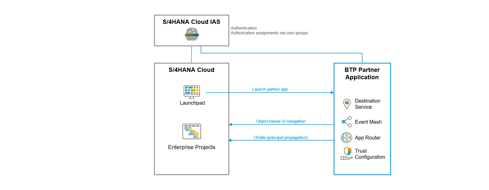
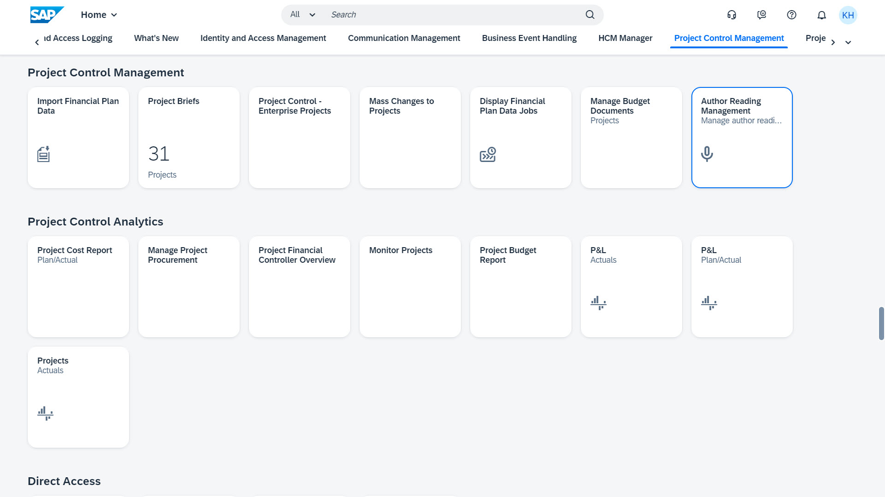

# Configure the Integration with *SAP S/4HANA Cloud, public edition*

In this chapter we connect an *SAP S/4HANA Cloud* tenant (representing the customers cloud ERP system), the *SAP Identity and Authentication Service* (IAS) tenant of the S/4 system (acting as corporate identity provider), and the BTP consumer subaccount (with the customer subscription of the partner application).

Frontend integration:

1.  Launch the BTP app from the S/4 launchpad,
2.  Launch BTP administration applications such as the IAS admin application and the audit log viewer from the S/4 launchpad,
3.  Navigate from the BTP application to related S/4 enterprise projects,
4.  Single sign-on for S/4, the BTP app and all BTP admin apps using the same customer IAS tenant as IDP.

Back-channel integration:

5.  Create and read S/4 enterprise projects from the BTP app using OData APIs with principal propagation.

## Configure Single Sign-on for S/4HANA Cloud

In our scenario we reuse the *SAP Identity and Authentication Service* (IAS) tenant that is used by the *S/4HANA Cloud* tenant for authentication.  
Therefore the trust-relationship between the S/4 tenant and the IAS tenant is already established and no further activities are required here.

## Configure Single Sign-on for the BTP Application

In our scenario we reuse the *SAP Identity and Authentication Service* (IAS) tenant that is used by the *S/4HANA Cloud* tenant for authentication.  
Therefore configure a trust relationship between the BTP consumer subaccount and the IAS tenant of *S/4HANA Cloud* as described in chapter [Configure Trust using SAML 2.0](45-Multi-Tenancy-Provisioning.md).

## Configure S/4HANA Cloud OData Services to create and read Enterprise Projects

Search for the following OData APIs on the [SAP API Business Hub](https://api.sap.com/package/SAPS4HANACloud/all) and take note of the communication scenarios per API:
- [*Enterprise Project*](https://api.sap.com/api/API_ENTERPRISE_PROJECT_SRV_0002/overview) (OData v2): Communication scenario *Enterprise Project Integration* (SAP_COM_0308)
- [*Enterprise Project - Read Project Processing Status*](https://api.sap.com/api/ENTPROJECTPROCESSINGSTATUS_0001/overview) (OData v4): Communication scenario: *Enterprise Project - Project Processing Status Integration* (SAP_COM_0725)
- [*Enterprise Project - Read Project Profile*](https://api.sap.com/api/ENTPROJECTPROFILECODE_0001/overview) (OData v4): Communication scenario: *Enterprise Project - Project Profile Integration* (SAP_COM_0724)

Create a new *Communication System* that represents the BTP consumer subaccount:
| Parameter name: | Value:                                                                                 |
| :-------------- | :------------------------------------------------------------------------------------- |
| *System ID*:    | "PRA-ARMT-S2" (here, I reuse the sub-domain name "armt-s2" of the consumer subaccount) |
| *System Name*:  | "Partner Applications - Author Reading Management Tenant 2"
| *Host Name*:    | Enter the hostname of the subscription of the partner reference application   (for example: "armt-s2.{cloud foundry endpoint}") |

Add a *Communication User* for inbound communication to the *Communication System* (create a new user):
| Parameter name: | Value:                                                                                 |
| :-------------- | :------------------------------------------------------------------------------------- |
| *User Name*:    | "PRA-ARMT-S2-USER" (here, I reuse the sub-domain name "armt-s2" of the consumer subaccount) |
| *Description*:  | "Technical user for Author Reading Management"                                         |
| *Password*:     | Choose a secure password                                                               |

Create a new *Communication Arrangement*: Open *Communication Scenario* "SAP_COM_0308" and start the configuration using bottom "Create Comm. Arrangement":
| Parameter name:         | Value:                                                                       |
| :---------------------- | :--------------------------------------------------------------------------- |
| *Arrangement Name*:     | Choose a meaningful name, for example "Author Reading Management - Projects" |
| *Communication System*: | Choose the communication system created above                                |
| *Inbound Communication - User Name*: | Choose the user for inbound communication created above         |
| *Inbound Communication - Authentication Method*: | "User ID and Password"                              |

Take note of the user name and password of the communication user as **S/4 Communication User** and **S/4 Communication User Password** for later reference. 

Create further communication arrangements for the other two OData services using the same communication system and communication user:
- Communication arrangement "Author Reading Management - Project Profile" for communication scenario "SAP_COM_0724"
- Communication arrangement "Author Reading Management - Project Status" for communication scenario "SAP_COM_0725"

You can now consume the OData service using the technical user and basic authentication (user/password).

## Configure OAuth-Authentication for OData Services

We are using *OAuth 2.0 SAML Bearer authentication* to access the S/4HANA Cloud OData service to read and write ByD projects with the user-context initiated by the user on the UI of the BTP application. In result S/4HANA Cloud user authorizations apply on the BTP application as well. Users without the permission to manage projects in S/4HANA Cloud can still open the BTP application, but S/4 enterprise project data is not retrieved and projects cannot be created.

Steps to configure S/4HANA Cloud for *OAuth 2.0 SAML Bearer authentications*:

BTP consumer subaccount: Get the signing certificate of the BTP UAA service as OAuth Identity provider:

1.  Open the menu item *Connectivity* >> *Destinations*, click on *Download Trust* and save the file with the signing certificate. Change the file name using ".cer" as file extension, for example "btp-signing-certificate.cer".

> Note: In result you have a file with the **BTP Subaccount Signing Certificate** (with file extension ".cer"). Keep the file for later reference.

S/4HANA Cloud: Configure an *OAuth 2.0 Identity Provider*:

2.  Open the *Communication System* "Partner Applications - Author Reading Management Tenant 2" created above
3.  Activate "OAuth 2.0 Identity Provider"
4.  Upload the **BTP Subaccount Signing Certificate** via bottom "Upload Signing Certificate"
5.  Copy the "CN"-property of the "Signing Certificate Issuer" into field "OAuth 2.0 SAML Issuer"
6.  Keep the "User ID Mapping Mode" = "User Name"

S/4HANA Cloud: Change the authentication method of the communication arrangement for enterprise projects to OAuth 2.0:

7.  Open the *Communication Arrangement* "Author Reading Management - Projects" created above 
8.  Navigate to "Inbound Communication": Reselect the user for inbound communication and choose the same user with authentication method "OAuth 2.0".
9.  Take note of the **S/4 OData Service URL** (Service URL of service Enterprise Project) and the OAuth 2.0 Details: 
    - **S/4 OAuth Client ID** (this is the same as the **S/4 Communication User**), 
    - **S/4 OAuth Client Secrete** (this is the **S/4 Communication User Password**), 
    - **S/4 OAuth User Name**, 
    - **S/4 OAuth Token Service URL**, 
    - **S/4 OAuth SAML2 Audience**, 
    - and the **S/4 OAuth Scope** "API_ENTERPRISE_PROJECT_SRV_0002".

> Note: The OData services for project profiles and project processing status do not support OAuth and therefore we will consume those services using a basic authentication.

Open the S/4HANA Cloud UI (here using Chrome as browser) and click on the lock icon *View site information* on the left side of the URL and export the **S/4 Server Certificate** as Base-64 encoded "X.-509"-file.

## Setup Destinations 

In this chapter we create three destinations in the BTP consumer subaccount:
- destination "s4hc" to consume S/4 OData services with principal propagation, 
- destination "s4hc-tech-user" to consume S/4 OData services using a technical user, and
- destination "s4hc-url" to provide the S/4 hostname for UI navigations and the name of the S/4 system as used by business users.

BTP consumer subaccount: Create destination "s4hc" to consume S/4HANA Cloud OData services with principal propagation. 

1.  Open the menu item *Connectivity* of the BTP consumer subaccount, click on *Destinations* and create a *New Destination* with the following field values:

    | Parameter name:           | Value:                                                                                    |
    | :------------------------ | :---------------------------------------------------------------------------------------- |
    | *Name*:                   | *s4hc*                                                                                    |
    | *Type*:                   | *HTTP*                                                                                    |
    | *Description*:            | Destination description, for example "S/4HANA Cloud XXXXXX with principal propagation"    |
    | *URL*:                    | API endpoint of your S/4HANA Cloud system, for example   “https://myXXXXXX-api.s4hana.ondemand.com” |
    | *Proxy Type*:             | *Internet*                                                                                |
    | *Authentication*:         | *OAuth2SAMLBearerAssertion*                                                               |
    | *Audience*:               | Enter the **S/4 OAuth SAML2 Audience**, for example   "https://myXXXXXX.s4hana.ondemand.com" |
    | *AuthnContextClassRef*:   | *urn:oasis:names:tc:SAML:2.0:ac:classes:X509*                                             |
    | *Client Key*:             | Enter the **S/4 OAuth Client ID**                                                         |
    | *Token Service URL*:      | Enter the **S/4 OAuth Token Service URL**, for example   "https://myXXXXXX-api.s4hana.ondemand.com/sap/bc/sec/oauth2/token" |
    | *Token Service User*:     | Enter the **S/4 OAuth Client ID**                                                         |
    | *Token Service Password*: | Enter the **S/4 OAuth Client Secrete**                                                    |

    Enter the Additional Properties:
    
    | Property name:  | Value:                                                          |
    | :-------------- | :-------------------------------------------------------------- |
    | *nameIdFormat*: | *urn:oasis:names:tc:SAML:1.1:nameid-format:emailAddress*        |
    | *scope*:        | Enter the **S/4 OAuth Scope** (API_ENTERPRISE_PROJECT_SRV_0002) |
    | *userIdSource*: | *email*                                                         |

    > Note: The OAuth SAML bearer authentication requires some steps in S/4 to assign the authorizations for the OData API to a business user: You need to assign the scope *API_ENTERPRISE_PROJECT_SRV_0002* to a *Business Catalog* and finally to your business user. For testing you may configure a basic authentication using the **S/4 Communication User** and **S/4 Communication User Password** for destination "s4hc" (same as for destination "s4hc-tech-user" below).

    > Note: You may need to upload the **S/4 Server Certificate** into the destination service for SSL authentication using the link *Upload and Delete Certificates* on the destinations screen. You can download the S/4 server certificate from the browser (Open the ByD UI and view the site information; then display and export the certificate details into a ".cer"-file).

BTP consumer subaccount: Create destination "s4hc-tech-user" to consume S/4HANA Cloud OData services using a technical communication user.

2.  Open the menu item *Connectivity* of the BTP consumer subaccount, click on *Destinations* and create a *New Destination* with the following field values:

    | Parameter name:   | Value:                                                                            |
    | :---------------- | :-------------------------------------------------------------------------------- |
    | *Name*:           | *s4hc-tech-user*                                                                  |
    | *Type*:           | *HTTP*                                                                            |
    | *Description*:    | Destination description, for example "S/4HANA Cloud XXXXXX with technical user"   |
    | *URL*:            | API endpoint of your S/4HANA Cloud system, for example   “https://myXXXXXX-api.s4hana.ondemand.com” |
    | *Proxy Type*:     | *Internet*                                                                        |
    | *Authentication*: | *BasicAuthentication*                                                             |
    | *User*:           | Enter the **S/4 Communication User**                                              |
    | *Password*:       | Enter the **S/4 Communication User Password**                                     |

BTP consumer subaccount: Create destination "s4hc-url" to launch S/4HANA Cloud apps and to store the name of the S/4 system used by business users. 

3.  Open the menu item *Connectivity* of the BTP consumer subaccount, click on *Destinations* and create a *New Destination* with the following field values:

    | Parameter name:   | Value:                                                                                  |
    | :---------------- | :-------------------------------------------------------------------------------------- |
    | *Name*:           | *s4hc-url*                                                                              |
    | *Type*:           | *HTTP*                                                                                  |
    | *Description*:    | Enter the name of your S/4 system used by your buisness users,   for example "My Productive SAP System" |
    | *URL*:            | UI endpoint of your S/4 system, for example   “https://myXXXXXX.s4hana.ondemand.com” |
    | *Proxy Type*:     | *Internet*                                                                              |
    | *Authentication*: | *NoAuthentication*                                                                      |

    > Note: The destination URL is used to store the hostname of the S/4HANA Cloud system. By storing the base-URL in a destination, we make sure that connecting the BTP web application to the S/4HANA Cloud systems is a pure configuration task and does not require any code changes.   At runtime we dynamically assemble the parameterized URL to launch the project planning view of S/4HANA Cloud enterprise projects by concatenating this base-URL with the floorplan-specific path and the object-specific parameters (for example the project ID). The authentication method is not relevant in this destination and therefore we choose "NoAuthentication" for simplicity (of course this destination cannot be used to use any S/4HANA Cloud service directly).

    > Note: The destination description is used to store the name of the S/4 system used by business users. At runtime we use this description to refer to the S/4 system on the UI of the BTP application.

## Add the BTP Applications to the S/4HANA Cloud Launchpad

As last step we create custom tiles for the S/4HANA Cloud launchpad to launch our partner application "Author Reading Management" as well as related administrative apps.

BTP consumer subaccount:

1.  Launch the **BTP Application Tenant URL** and copy the link address of the application "Manage Author Readings". 

S/4HANA Cloud Customizing Tenant: Create a custom tile and trigger the transport to the test system

2.  Open the application "Custom Tiles" and add a new tile with the field values
			
    | Field:       | Value:                                                                                  |
    | :----------- | :-------------------------------------------------------------------------------------- |
    | *Title*:     | "Author Reading Management"                                                             |
    | *ID*:        | "AUTHORREADINGMANAGEMENT"                                                               |
    | *Subtitle*:  | "Manage author readings and poetry slams"                                               |
    | *URL*:       | Enter the **BTP Application Tenant URL**                    |
    | *Icon*:       | Choose an icon, for example "sap-icon://microphone"                  |
            
	Click on "Assign Catalogs" (lower right corner) and add add a *Business Catalog*, for example "Project Systems - Project Control Management".
	
    Click on "Publish".

3. 	Open the application "Export Software Collection" and add a new software collection with name "Partner Add-on Author Reading Management - Launchpad" to the List of "Software Collections" using button "+" (left side)

    In the software collection: Add your launchpad enhancement to the software collection by button "Add Items" and select the items:  
    - Custom tile "Author Reading Management"  
	- The custom catalog extension "App YY1_AUTHORREADINGMANAGEMENT_CAP is used in business catalog SAP_PS_BC_PCM_MC."  
	
    Press "Check"-"All items" and check the log.
	
    Press "Export"-"All items" and wait till the status of the software collection changed to "Status: Exported".

S/4HANA Cloud Test Tenant: Import the custom tile

4.  Open the application "Import Collection" and search the software collection "Partner Add-on Author Reading Management - Launchpad" exported before (for example by using the search property "Last Changed On").

    Select the software collection "Partner Add-on Author Reading Management - Launchpad" and press button "Import"; check the risk and press button "Import" again.

    Wait until the status turns to "Imported".

5.  Open the "App Finder" in your user profile (click on your profile image in the upper right corner) and search for the catalog "Project Systems - Project Control Management". 

    Optional: Here you can assign the app to a different or new app group. 

    >Note: Refresh your browser window if the app is not listed.

Now you find the application "Author Reading Management" on the S/4HANA Cloud launchpad in group "Project Control Management".

Repeat the same steps with suitable business catalogs to create custom tiles for the *Identity Authentication Service* admin application and the subscription of *Audit Log Viewer* in the consumer subaccount.

## Create Users and Assign Authorizations

In our app design we rely on the business users and authorizations being created and managed in the Cloud ERP solution (here: *SAP S/4HANA Cloud*) and the customers identity provider (here the *Identity Authentication Service* connected to S/4HANA Cloud).
As a general approach you create the user in the ERP solution and the identity provider (IAS), and then assign the user group that includes the authorization to the partner application to the user on the identity provider (IAS).

Step for *SAP S/4HANA Cloud* as Cloud ERP:

1.  S/4: Hire an employee via *SuccessFactors Employee Central* or create an employee via employee import. Make sure to maintain the e-mail address of the employee (this e-mail is used as user identifying attribute for single sign-on).

2.  S/4: Open the application "Maintain Business Users" and assign the business roles:  
    - "Project Manager" (SAP_BR_PROJECTMANAGER)  
    - "Project Financial Controller" (BR_PROJ_FIN_CONTROLLER) - required to create enterprise projects via OData  
    - "Administrator" (SAP_BR_ADMINISTRATOR) - required to configure APIs and to create custom tiles  

3.  IAS: Create the same user in the *Identity Authentication Service* system and enter the same e-mail address used in the S/4 system.

4.  IAS: Assign the user group with the authorization for the BTP application (for example the user group *Admin* or *AuthorReadingManager*) to the user.

> Note: Make sure to maintain the same e-mail address for users in the Cloud ERP and the IAS tenant. Otherwise single sign-on and the API-led integration using OAuth SAML bearer does not work.

## Test

Test the integration and the single sign-on authentication: Open the S/4HANA Cloud launchpad and login using your S/4 user. Then launch the BTP application via custom tile on the S/4HANA Cloud launchpad. The BTP application opens in a new browser tab without additional authentication promt.

Mission accomplished :-)
