## Assumptions / Preconditions

- An own BTP Global Account
  - with unused quota for 1 Cloud Foundry 
  - with unused quota for 1 SAP Business Application Studio  

## Setup BTP Subaccount

### Create Subaccount

At first navigate to your BTP GlobalAccount and create a new Subaccount with name ***AuthorReadings***.
> BTP Cockpit: https://cockpit.eu10.hana.ondemand.com/cockpit.

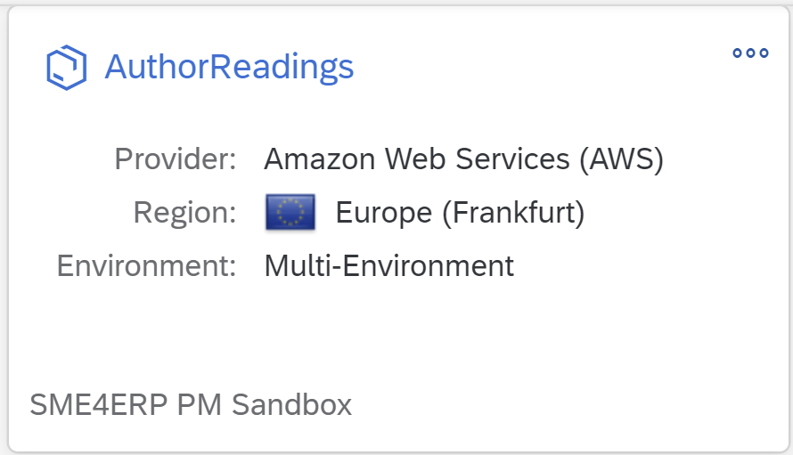

### Enable Cloud Foundry
By default Cloud Foundry is disabled for new BTP Subaccounts, because not everey Subaccount is meant for application development.

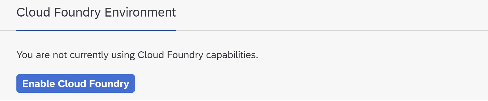

Enable Cloud Foundry using the proposed standard settings.

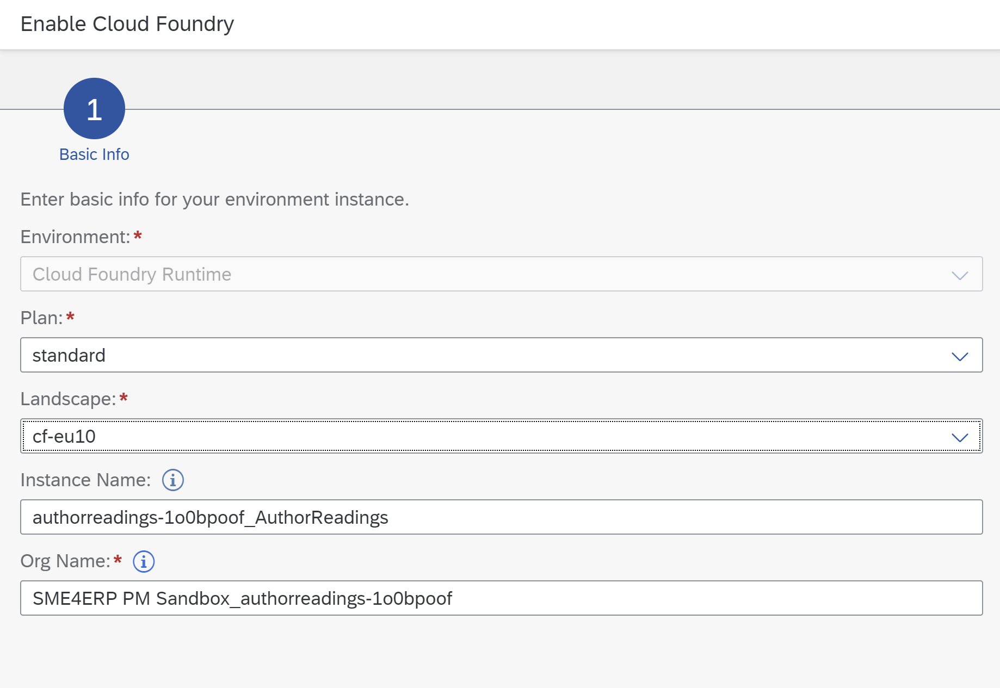

### Enable SAP Business Application Studio

After creating a new Subaccount, only the standard services appear in the entitlements list. To enable SAP Business Application Studio, assign an according entitlement to the newly created BTP Subaccount.

- Navigate to the BTP Account and go for ***Entitlements*** and ***Entity Assignments***
- Open the value help on the ***Select Entities*** field and mark the BTP Subaccount

  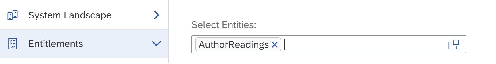

- Press on ***Configure Entitlements*** and then ***Add Service Plans***

  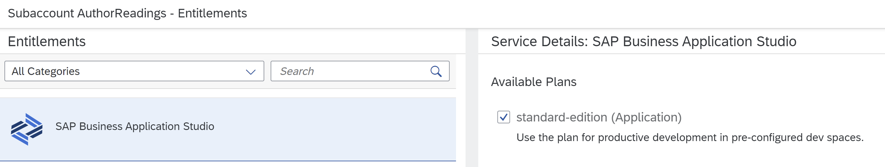

- Press on ***Add 1 Service Plan*** and ***Save***

Navigate back to the BTP Subaccount. The *SAP Business Application Studio* is now available in the list of Entitlements. Create an instance of this service within the BTP Subaccount. Therefore go to ***Service Marketplace*** and look for SAP Business Application Studio and press ***Create***.

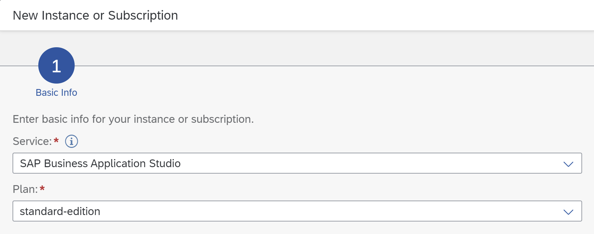

The instance appears in the list of subscriptions.

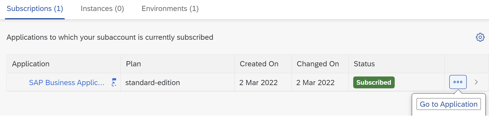

Just starting it will result in an *Access Denied* because the user roles are not yet assigned for this service instance. To do so, go to ***Security*** and ***Users***. Select your user and and go to the assigned ***Role Collections***. Select all 3 roles of *SAP Business Application Studio* and confirm assignment.

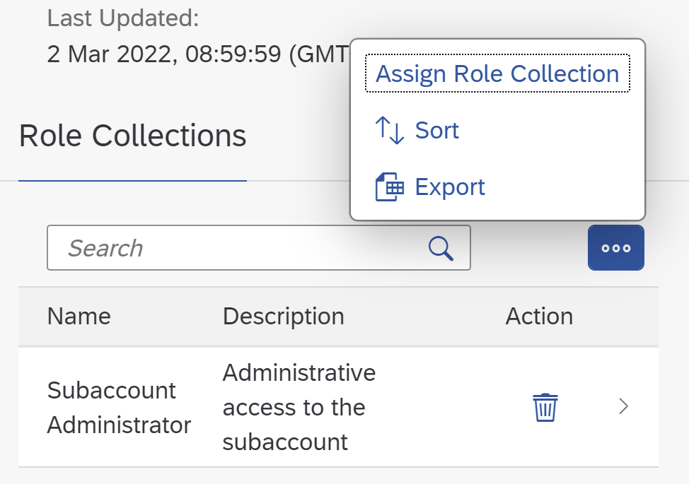

Three role collections have been added by *SAP Business Application Studio* already.

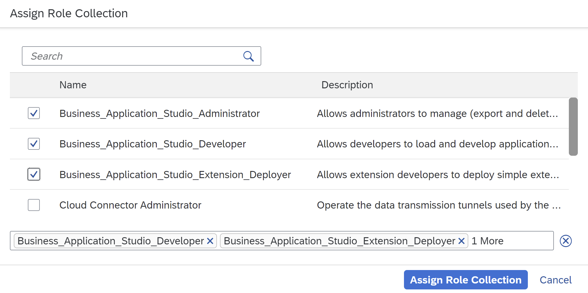

Now start the *SAP Business Application Studio*. If the access is denied wait some seconds and try again.

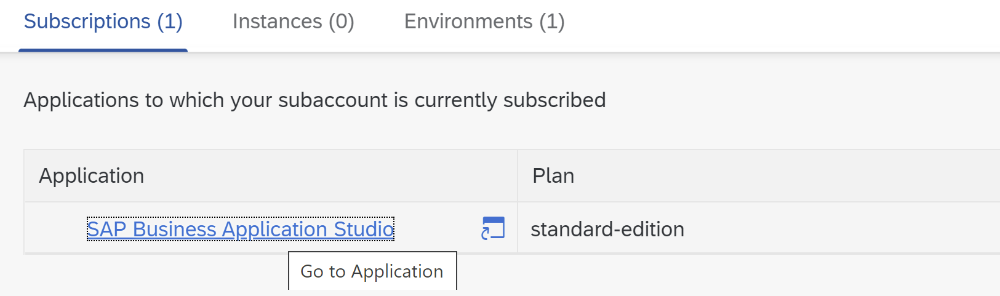

After starting the development environment a new ***Dev Space*** for the development needs to be created. Name it ***AuthorReadings** and choose to create a ***Full Stack Cloud Application***.

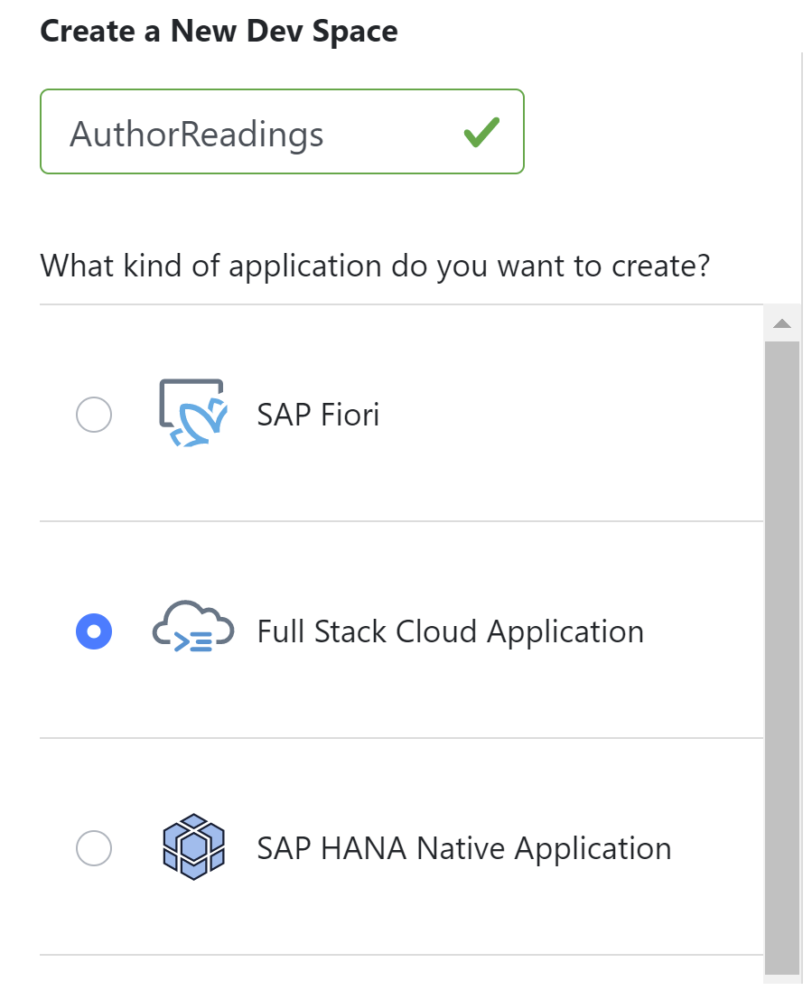

## Setup GIT repository
Create a new github repository in a github organization of your choice and link the newly created ***Development Space*** to it by doing a ***git clone**.
